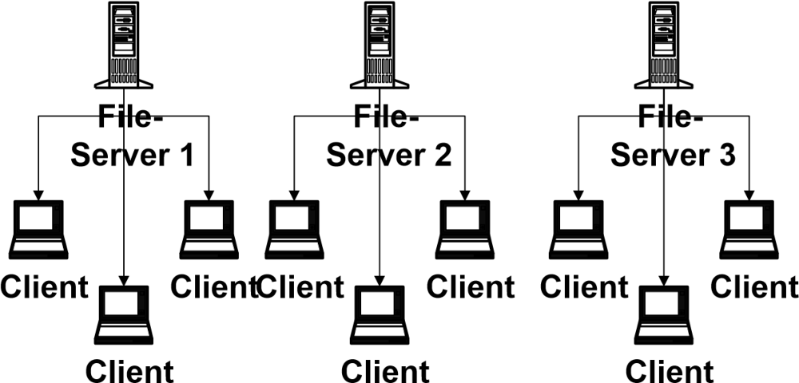

# Vorüberlegungen
## Rahmenbedingungen am IIS
### Heterogenes (IT)Umfeld
Am IIS sind eine **Vielzahl** der verfügbaren **Betriebssysteme** (WindowsNT, Windows95/98, Windows3.11, HP/UX, Solaris, SunOS, OS/2, MacOS, Novell, Linux) sowie eine Vielzahl von **Hardwareplattformen** (Sun, HP, PC, Macintosh, etc.) im Einsatz. Es ergeben sich Probleme, die im Folgenden beschrieben werden.

Da auf den einzelnen Plattformen die **Benutzerverwaltungen unterschiedlich** sind, müssen Daten, wie Login und Passwort, auf mehreren Systemen synchron verwaltet werden, was einen hohen Administrationsaufwand bedeutet.

Auf den Plattformen NT, UNIX und Mac sind die **Rechteverwaltungen** grundsätzlich **verschieden**. Nutzer, die auf mehr als einem System Daten verwalten, müssen Kenntnisse über mehrere Systeme haben.

Die **Supportressourcen** sind auf viele Plattformen **verteilt** und können nicht fokussiert werden. In der Praxis bedeutet das, dass zwar alle genannten Plattformen angeboten, diese aber nicht in ausreichendem Maß unterstützt werden können.

Die Bereitstellung von Speicherplatz für die einzelnen Plattformen ist schwierig (zum Beispiel Konvertierung von Rechten UNIX/NT), da die **Standards**, die bei den einzelnen Betriebssystemen zum Einsatz kommen, **nicht kompatibel** sind (zum Beispiel NFS, SMB, FAT, NTFS).

Das gleiche Bild wie bei Betriebssystemen und Hardwareplattformen bietet sich bei der im Einsatz befindlichen **Anwendersoftware**. Es gibt keine Reglementierung, die den Anwender auf bestimmte Produkte beschränkt. Da die Formate der einzelnen Applikationen in der Regel nicht austauschbar sind, ergeben sich Probleme bei der Weiterverwendung der Dateien mit anderen Softwarepaketen.

Die Wahrscheinlichkeit, dass es eine solche Reglementierung in naher Zukunft geben wird, ist gering. Deswegen muss das zu konzipierende System die bestehende Vielfalt unterstützen.

### Vorhandene Plattformen
Wie sich zeigen wird, muss eine Plattform, auf der Wissensmanagement implementiert werden soll, bestimmte Anforderungen erfüllen. Dazu gehören neben **Offenheit**, **Flexibilität** und **Sicherheit** vor allem die Eigenschaften **Plattformunabhängigkeit** (gerade im Bezug auf die vorhandene Heterogenität), **einfache Bedienbarkeit** und die **Zugriffsmöglichkeit mit Standardsoftware**.

Am IIS existieren bereits zwei Ansätze, die für eine solche Plattform in Betracht gezogen werden können, **Lotus Notes** und das Intranet (https://www-local/private) des IIS.

#### Lotus Notes
Zum Zeitpunkt der Arbeit waren über die Basisfunktionalität des Notessystems hinaus, abgesehen von einer **Adressdatenbank** und einem **Helpdesksystem**, keine Applikationen verfügbar, die allen Mitarbeitern am Institut einen Nutzen bringen konnten.

In den einzelnen Abteilungen sind teilweise in Eigeninitiative kleine Applikationen entstanden, die dort auch erfolgreich eingesetzt werden. Ein Beispiel hierfür ist ein **Software-Fehlerverfolgungssystem**, das nur mit Notes-Standardfunktionen erstellt wurde.

Ein Mitarbeiter, der einen Client installiert, muss sich zunächst einmal in die relativ komplizierte Bedienung von Lotus Notes einarbeiten.

Da Lotus Notes in der Version 4.6 eingesetzt wird, ist das Bedienen über einen Browser nur bedingt möglich. Eine sinnvolle Nutzung setzt den Notes-Client voraus.

Die Administration des Notesservers erfolgt zentral durch die Rechnerbetreibergruppe. Eigene Inhalte müssen mit ihrer Hilfe und Zustimmung auf den Server gebracht werden.

Wie bereits erwähnt, wird für die sinnvolle Nutzung von Lotus Notes ein spezieller Client benötigt. Die Installation dieses Clients erfordert die Präsenz eines Systemadministrators und cirka 20 Minuten pro Installation.

Probleme ergeben sich mit der Kompatibilität von Windows- und Mac-Clients. Die Unterstützung des Clients für die Sun-Workstation ist ab Version R5 eingestellt worden. Das **Benutzerkonzept** von Lotus Notes ist ganz anders aufgebaut, als das von Windows oder Mac. Bei der Einarbeitung muss eine sehr steile Lernkurve durchlaufen werden.

Die vom IIS auf Lotus Notes implementierten Funktionen sind **zumeist nicht dokumentiert**, was den Einstieg erschwert. Für neue Notes Nutzer gibt es keine Möglichkeit, sich schnell in das System einzuarbeiten, weil der Notes-Client nicht intuitiv bedienbar ist. Es existiert kein Einführungskonzept, mit dem die Mitarbeiter an die Nutzung von Notes herangeführt werden.

**Fazit:** Lotus Notes ist zwar sehr gut geeignet, um die Funktion eines Wissensmanagementsystems zu übernehmen. Allerdings existiert am IIS keine klare Einführungsstrategie, was die Frage aufwirft, ob Notes in einem sinnvollen Zeitraum am Institut für alle Mitarbeiter verfügbar sein wird.
Wegen der steilen Lernkurve bei Administration, Entwicklung und Nutzung ist die Einführung von Lotus Notes sehr ressourcenintensiv.

#### Intranet
Das Intranet wird bereits als **Präsentationsplattform** von verschiedenen Gruppierungen am IIS genutzt (zum Beispiel PR-Runde). Allerdings fehlen Präsentationen wichtiger anderer Gruppierungen wie beispielsweise die des Leitungskreises. Es gibt somit keinen Informationskanal, der von den Mitarbeitern zum Leitungskreis geht, außer persönlichen Emails und den Infotreffs, die in regelmäßigen Abständen statt finden.

Die Möglichkeit für Mitarbeiter oder Gruppierungen, **eigene Inhalte** einzustellen, ist **schwierig**. Zwar gibt es einen Bereich (https://www-local/private/user), in dem jeder Mitarbeiter Webseiten ablegen kann, diese werden aber nicht auf die Intranetseiten verlinkt und sind somit nur schwer zu finden.

Im bestehenden Intranet existierte bis zum Zeitpunkt dieser Arbeit **keine** Möglichkeit, auf den Inhalten eine **Volltextsuche** durchzuführen. Aus diesem Grund wurde eine Suchmaschine für das Intranet implementiert, die im oben genannten Bereich 17.000 Dokumente (davon über 3000 HTML Dokumente) festgestellt hat.

Große Teile der Informationen im Intranet sind veraltet. Im Softwarebereich sind beispielsweise Softwarepakete zu finden, für die Mitarbeiter verantwortlich sind, die schon seit Jahren nicht mehr am Institut arbeiten. Ein Grund für diesen Zustand ist darin zu sehen, dass die Verwalter des Softwarebereichs nicht mit den einzelnen Softwarepaketen arbeiten.

Die Administration des Intranets ist **zentral** organisiert. Inhalte können nur in Absprache mit den Administratoren eingestellt werden, was die Einstiegsschwelle, eigene Inhalte einzubringen, erhöht.

Der große Vorteil des Intranets ist die einfache Bedienbarkeit mit einem **Standardbrowser**. Derartige Browser sind auf beinahe allen Rechnern installiert. Die Verbreitung von speziellen Clients ist nicht nötig, was eine enorme **Ressourcenersparnis** darstellt.

**Fazit:** Das Intranet bietet den Vorteil, dass die dort verfügbaren Inhalte für alle Mitarbeiter zugänglich sind. Leider ist die Interaktion mit dem Nutzer und das Einstellen eigener Inhalte bisher nur bedingt möglich und macht so den bisherigen Ansatz des Intranets für ein Wissensmanagementsystem unbrauchbar.

## Wissensformen
Bei Wissensformen kann man grundsätzlich zwischen explizitem und implizitem Wissen unterscheiden (Polanyi, Michael. The Tacit Dimension. London: Routledge & Kegan Paul).

Explizites Wissen (explicit knowledge) kann in Sprache ausgedrückt und zwischen Individuen transferiert werden. Als Vereinfachung ist unter explizitem Wissen das Wissen zu verstehen, das in Form von Dokumenten, Anleitungen, etc. erfasst werden kann.

Im Gegensatz dazu ist implizites Wissen (tacit knowledge) immer an Personen gebunden und ergibt sich aus deren persönlicher Erfahrung, Perspektive und Wertvorstellungen.

Implizites Wissen ist immer an Menschen oder Gruppen von Menschen gebunden. Der Übergang von implizitem zu explizitem Wissen kann zum Beispiel durch Dokumentation vollzogen werden.

### Explizit
#### Bücher
Bücher sind nach wie vor eine der wichtigsten Quellen für Wissen. Zu beinahe allen Themengebieten gibt es **Standardwerke**, die in dieser Ausführlichkeit und fachlichen Tiefe nicht im Internet zu finden sind.

Am IIS gibt es eine hauseigene Bibliothek (https://www-local/private/iisinfo/bib), die sowohl einen **Präsenzbestand** pflegt als auch für die **Beschaffung** von neuen Büchern verantwortlich ist. In den Intranetseiten der Bibliothek besteht die Möglichkeit, den Bestand abzufragen.

Das Suchinterface (http://www-local/private/cgi-bin/buchneu.pl) lässt detaillierte Abfragen nicht zu und schließt Zeitschriften nicht mit ein. Sinnvoll wäre die Einbindung der Datenbank in ein globales Suchinterface, das gleichzeitig auch in Diskussionsgruppen, FAQs, etc. suchen kann.

Eine weitere Verbesserung wäre die Erfassung von **weiterführenden Informationen** zu Büchern und Zeitschriften. So könnte jeder Mitarbeiter, der ein Buch benutzt, Beurteilungen, Hinweise auf Links, Artikel und weitere Bücher empfehlen.

Des weiteren verfügt das Institut über einen CD-Server (http://cdserv03), auf dem die Jahrgangs-CDs einiger Zeitschriften verfügbar sind (zum Beispiel Microsoft Developper Network). Dieses Angebot sollte im Bereich der Fachliteratur und der Jahrgangs-CDs verschiedener Zeitschriften ausgebaut werden und um ein Suchinterface erweitert werden.

**Fazit:** Das existierende Angebot der IIS Bibliothek ist gut aber ausbaufähig. Insbesondere sollte die Verbesserung des Suchinterface und die Einbindung von Zeitschriften angedacht werden. Zu den Ressourcen wäre eine Erfassung von Metadaten und die Möglichkeit, Kommentare bzw. weiterführende Informationen abzulegen, sinnvoll.

#### Dokumente
Einen großen Anteil an der Wissensspeicherung haben Dokumente in elektronischer und in Papierform.

Ein Dokumentenmanagementsystem, das den Mitarbeitern viel Arbeit bei der Verwaltung und dem Auffinden von Dokumenten abnehmen könnte, ist am IIS nicht im Einsatz. Ein solches ist in der Lage, **elektronische Dokumente** und **Papierdokumente** zu verwalten. Im Bereich der Dokumentenverwaltung ergeben sich aus der vorhandenen Heterogenität einige Schwierigkeiten, die im Folgenden genannt werden (siehe Abbildungen 2-1 und 2-2).

Es ist sehr schwer, Speicherplatz zur Verfügung zu stellen, der von allen Plattformen aus mit den gleichen Rechten benutzt werden kann. Das führt dazu, dass Transferverzeichnisse im Einsatz sind, auf die alle Mitarbeiter Lese- und Schreibrecht haben. Sowohl aus Sicherheits- als auch aus Administrationssicht ist diese Lösung ungeeignet.

Durch die Vielzahl der im Einsatz befindlichen Softwarepakete können Standardvorlagen nicht ausreichend unterstützt werden. Folglich wird durch die Mitarbeiter viel Energie in die Entwicklung von brauchbaren Vorlagen gesteckt, die dann allerdings nicht öffentlich zur Verfügung stehen, sondern auf den Rechnern der einzelnen Mitarbeitern verbleiben.

Den Mitarbeitern wird für das Erstellen Ihrer Dokumente kein Softwarepaket nahegelegt. Daraus ergibt sich das Problem, dass beispielsweise ein Bericht mit den unterschiedlichsten Programmen verfasst werden kann und dann in einem Format vorliegt, das von anderen nicht gelesen werden kann. Die **Wiederverwendbarkeit** von Dokumenten wird dadurch **stark eingeschränkt**. Im Einsatz sind Microsoft Office, Staroffice, Framemaker, Lotus Notes, Pagemaker und LaTeX.

Die **Dokumentenablage** ist **nicht genormt** oder vorgeschrieben. Das führt dazu, dass jeder Mitarbeiter seine Dokumente nach eigenen Schema benennen und ablegen kann. Zusatzinformationen (Metadaten) zu den Dokumenten (Autor, Datum, Version, Abstract) werden nicht erfasst.

**Fazit:** Ein Dokumentenmanagementsystem kann die Grenzen von Plattformen durchbrechen und den Dokumentenbestand transparent und nutzbar machen. Parallel zu einem solchen System müssen Regeln eingeführt werden, wie Dokumente einzustellen und welche Metainformationen (zum Beispiel Abstract) anzugeben sind.

**Notiz:** Dokumentenmanagement ist sehr umfassend und deswegen bei dem hier konzipierten System nicht berücksichtigt worden. Aus der Vielzahl der verfügbaren Produkte sollte eines ausgewählt werden, das sich problemlos in andere Anwendungen integrieren lässt. Weitere Informationen zur Vorgehensweise finden sich [im Intranet Design Magazine](https://web.archive.org/web/20001205030600/http://idm.internet.com/features/docmgmt9b-1.shtml).

#### Newsgruppen, Maillisten und Diskussionsforen
Von diesen drei Werkzeugen sind am IIS hauptsächlich Maillisten im Einsatz. Da aber alle genannten Werkzeuge sehr mächtig sind, werden sie hier im Einzelnen betrachtet.

##### Newsgruppen (Usenet)
Das Usenet ist relativ unbekannt, obwohl aus diesem großer Nutzen gezogen werden kann. Deswegen zunächst ein Überblick über die Eigenschaften des Usenet.

- Mehr als **35000** themenbezogene **Diskussionsgruppen**
- **Weltweite Vernetzung** aller Newsserver, dadurch Zugriff auf große menschliche Ressource
- **Zugriff** ähnlich **einfach** wie das Verwenden von Email
- Durch die weltweite Vernetzung und die **große Nutzerzahl** (cirka 100 Millionen) sehr kurze Antwortzeiten
- Durchsuchen aller bisher gestellten Fragen möglich, über **Archiv-Dienste** wie beispielsweise [Dejanews](https://de.wikipedia.org/wiki/Deja_News)

Die Hierarchie der Newsgruppen ist für den Einsteiger unübersichtlich, da es eine **themenorientierte Hierarchie** gibt (zum Beispiel comp.*für Computer-Themen), aber auch eine **geographische** (zum Beispiel "de.*für deutsche Newsgruppen).

**Tipp:** Nahezu jeder Mitarbeiter am IIS ist mit allem ausgestattet um das Usenet zu nutzen. Sowohl der Netscape Navigator als auch Outlook Express können mit Newsservern kommunizieren. Der IIS-Newsserver heisst news.iis (bereits voreingestellt in Netscape) und antwortet auf dem Port 119. Wer die Hierarchie der Newsgruppen unübersichtlich findet, kann bei W3C (URL nicht mehr funktionsfähig) eine Übersicht finden.

**Tipp:** Zu den meisten Softwarepaketen gibt es eigene Newsgruppen, so auch für das CAD-Paket Cadence (news://comp.cad.cadence).

##### Maillisten
Wie erwähnt, werden Maillisten am IIS seit einiger Zeit verwendet (Eine Übersicht der existierenden Gruppen findet sich im Intranet (http://www-local/private/sysadmin/mail/listen.html)). Als **Listserver** ist das Paket [Majordomo](https://de.wikipedia.org/wiki/Majordomo) im Einsatz.

Die Funktion eines solchen Listservers ist einfach. Jede existierende Liste hat eine Mailadresse (zum Beispiel iis-all@iis (mailto:iis-all@iis.fhg.de)) und eine Anzahl an Mitgliedern. Jede an die Adresse einer Liste geschrieben Mail wird an alle Mitglieder der Liste per Mail weitergeleitet. Daraus ergeben sich gegenüber Onlinediskussionsforen signifikante Nachteile.

Die **Darstellungsmöglichkeiten sind eingeschränkt**, da nicht jeder Mailclient HTML-Mails darstellen kann. Infolgedessen ist die **Darstellungsform auf** reinen **Text beschränkt**. Grafiken, Tabellen, etc. sind nicht möglich.

Ein **Archiv** der Liste ist **nicht verfügbar** (siehe Abbildung 2-3). Jedes Listenmitglied entscheidet selbst, ob es die Mails der Liste aufhebt oder nicht. Neue Listenmitglieder haben keine Möglichkeit, auf frühere Mails zuzugreifen.

Die **Weiterverwendung** der Inhalte (zum Beispiel um eine FAQ zu erstellen) ist **nur bedingt möglich**.

##### Diskussionsforen
Ein Diskussionsforum bietet die Möglichkeit, Diskussionen zu bestimmten Themen online zu führen. Es ist möglich, die Diskussionsinhalte per Email zu verschicken.

Alle Beiträge werden in einer Datenbank abgelegt und stehen somit für eine Weiterbearbeitung zur Verfügung.

**Fazit:** Das Usenet kann als eine externe, kostenlose Ressource betrachtet werden. Durch die Einrichtung von Onlinediskussionsforen können signifikante Verbesserungen im Bereich Kommunikation und Sicherung der Diskussionsinhalte erreicht werden.

#### Zeitschriften, Zeitungen
Einige Bemerkungen zu Zeitschriften wurden bereits im Abschnitt über Bücher gemacht. Weiterhin ist festzustellen, dass der sogenannte Zeitschriftenumlauf, bei dem einer Zeitschrift eine Verteilerliste angehängt und diese dann auf die Reise durch das Institut geschickt wird, ineffizient sein kann.

**Zeitschriften erreichen** den **Mitarbeiter**, der weit hinten auf der Verteilerliste steht, oftmals sehr **spät**. Eine Größenordnung von einigen Monaten ist keine Seltenheit. Dies liegt daran, dass Zeitschriften oftmals für lange Zeit bei einzelnen Mitarbeitern verweilen. Andere können nicht mitverfolgen, wo sich die Zeitschriften momentan befinden.

Wissen, das ein einzelner Mitarbeiter aus Artikeln gewinnt (zum Beispiel über die Relevanz des Artikels), wird nicht erfasst. Außerdem können weitere Informationen zu den Artikeln, die ein Mitarbeiter zum Beispiel durch eine Recherche im Internet zu einem Artikel macht, nicht aufgenommen werden.

Der Inhalt der Zeitschrift ist erst in dem Moment bekannt, in dem die Zeitschrift bei dem Mitarbeiter eintrifft. Es besteht keine Möglichkeit, über Titel und Zusammenfassung den persönlichen Wert der Zeitschrift abzuschätzen.

**Fazit:** Folgendes Modell könnte bei den Zeitschriftenumläufen eine Verbesserung ergeben: Jeder Umlauf bekommt einen **"Manager"**, der die Zeitschrift zuerst erhält. Er macht zum Beispiel alle **Artikeltitel Online** verfügbar. Damit kann jeder Umlaufteilnehmer die Relevanz der Zeitschrift abschätzen. Über dieses Onlineangebot können dann auch Kommentare zu den einzelnen Artikeln abgegeben oder weiterführende Informationen erfasst werden. Nur wer wirklich an einem der Artikel interessiert ist, erhält die Zeitschrift. Der Umlauf wird von einer Bring- zu einer Holschuld.

#### CDROM
Viele Informationen liegen mittlerweile multimedial auf CDROM vor. Eine gute Möglichkeit, diese zu veröffentlichen, stellen sogenannte CD-Server dar (siehe Abbildung 2-4), welche unterschiedliche Mengen von CD’s aufnehmen und diese im Netzwerk zur Verfügung stellen können.

Am IIS sind einige CD Server im Einsatz. Es besteht allerdings bisher keine Möglichkeit strukturiert auf den Inhalt der Server zuzugreifen. Der **Inhalt** der Server ist **nicht dokumentiert**.

**Fazit:** CD-Server sind gut geeignet, um Software oder Archiv-CDs aufzunehmen. Der Inhalt dieser Server sollte transparenter gemacht werden.

#### Software-Code
Softwarecode enthält, wenn er richtig dokumentiert ist, sehr viel **Wissen über Programmiertechniken und Problemlösungen** und kann gegebenenfalls auch gut wiederverwendet werden.

In vielen Fällen ist es sinnvoll, für bestimmte Funktionen Bibliotheken mit **getesteten Modulen** institutsweit zur Verfügung zu stellen. Dadurch muss zum Beispiel nicht jeder Mitarbeiter oder Diplomand sich seine eigenen Frequenzanalysatoren unter Matlab programmieren, sondern kann seine Energie darauf verwenden, bestehende Lösungen zu verwenden und zu verbessern.

Sehr wichtig, um den Verlauf eines Softwareprojekts verfolgen zu können, ist die Versionskontrolle. Diese stellt sicher, dass zu jedem Zeitpunkt des Projekts Zugriff auf ältere Versionen gewährleistet ist und deren Funktionalität mit den neuen Versionen verglichen werden kann.

**Tipp:** Ein sehr bewährtes Versionskontrollsystem ist CVS. Für dieses System stehen auch auf der Windowsplattform komfortable Werkzeuge wie WinCVS zur Verfügung. Um CVS-Funktionalität auch über das Web bereitzustellen, kann [CVSWeb](https://people.freebsd.org/~fenner/cvsweb/) verwendet werden.

**Tipp:** Mit CVS können nicht nur Softwarecodes verwaltet werden, sondern alle Arten von Projekten, die mit ASCII-Dateien arbeiten. Diese in XML verfasste Diplomarbeit wurde mit CVS verwaltet.

#### Briefe, Email
Briefe und Emails haben einen ganz beachtlichen Anteil am Kommunikationsaufkommen und sind damit wichtige Wissensträger.

In diesem Zusammenhang ist es sehr wichtig, Briefe und Emails, die einen bestimmten Personenkreis betreffen, für diesen zugänglich zu machen. Am IIS ist mit der Kundenkontaktdatenbank auf Lotus Notes Basis ein erster Anfang gemacht. Dieses Werkzeug steht allerdings nur einem kleinen Teil der Mitarbeiter zur Verfügung.

Mit Microsoft Outlook als Mailclient ist es beispielsweise sehr einfach möglich, den gesamten Mail und Briefverkehr automatisch mit zu protokollieren. Im Adressbuch besteht dann Zugriff auf die gesamte Kommunikation, die mit einer Person geführt wurde.

### Implizit
#### Erfahrung, Negativwissen
Erfahrungen sind deswegen im Bereich implizit angeordnet, da jeder Mensch seine eigene Vorgeschichte besitzt und damit auf ganz individuelle Erfahrungen zurückgreifen kann. Erfahrungen sind weiche Daten, die nicht ohne weiteres in Datenbanken oder Dokumenten abgelegt werden können.

Negativwissen im eigentlichen Sinn gibt es nicht, denn Negativwissen ist Wissen, wie man Dinge nicht macht. Dieses Wissen ist für zukünftige Entscheidungen sehr wichtig, da ungeeignete Ansätze von vornherein ausgeschlossen werden können und so ein Ziel direkt erreicht wird.

Auf der anderen Seite birgt Negativwissen aber auch eine große Problematik in sich, denn um es zu erfassen, müssen die einzelnen Mitarbeiter dazu gebracht werden, ihre **Fehler** zu **dokumentieren**. Das ist nur in einer Umgebung möglich, in der großes Vertrauen unter den Beteiligten herrscht.

Der einfachste Weg, Erfahrungen und Negativwissen nutzbar zu machen, ist, die Erfassung in den Projektablauf zu integrieren und damit als völlig selbstverständlich zu institutionalisieren (siehe Abbildung 2-5). Die meisten Projekthandbücher beinhalten die Elemente **Projektvorbereitung** (oder Kick Off) und **Projektnachbereitung** (erkennbar an Phrasen wie "...die Erkenntnisse aus dem Projekt sind zu dokumentieren und zu sichern..."). Die Sicherung der Erkenntnisse bei Abschluss eines Projekts wird oftmals aus Zeitgründen vernachlässigt.

Wenn am Ende eines jeden Projektes eine Projektnachbereitung eingeführt wird, können in dem darin enthaltenen Projektabschlussbericht Sektionen wie Was wir besonders gut gemacht haben, aber auch Welche Ansätze haben wir verworfen etabliert werden. Die Erfassung von Fehlern wird standardisiert und verliert an Brisanz.

**Fazit:** Negativwissen ist ein sehr wichtiger Bestandteil des Wissensmanagements. Die Probleme, die sich mit der Erfassung ergeben, können durch eine Integration der Erfassung in den Arbeitsablauf überwunden werden.

#### Handlungsmuster
Unter Handlungsmustern sind Prozesse zu verstehen, die in einem Menschen automatisch ablaufen, da er sie oft durchlaufen hat. Ein Beispiel für ein solches Handlungsmuster ist die Vorgehensweise bei der Recherche im Internet.

In den meisten Fällen verwenden Personen die Suchmaschine, die sie seit Beginn ihrer Internetaktivitäten verwendet haben. Die Tatsache, dass andere Suchstrategien, wie sie beispielsweise in der [Suchfibel](http://www.suchfibel.de) beschrieben werden, wesentlich effizienter sind, ist ihnen nicht bekannt. Der Punkt, an dem im Internet gesucht werden muss, hängt stark von der Art des Gesuchten ab. So gibt es neben den Suchmaschinen auch Kataloge, Mailarchive, Datenbanken, etc.

Weitere Handlungsmuster sind zum Beispiel die Dokumentenablage und die Organisation des Alltags (Zeitmanagement).

Wissensmanagement hat damit zu tun, bestehende Prozesse zu analysieren, Wissen über diese Prozesse zu gewinnen und den ganzen Prozess dann effizienter zu machen.

Eine wichtige Voraussetzung hierfür ist, den betroffenen Personen ihre Handlungsmuster bewusst zu machen und sie durch Verbesserungsvorschläge für einen **ständigen Verbesserungsprozess** zu sensibilisieren.

**Tipp:** Eine wichtige Methode in diesem Zusammenhang ist Kaizen. Unter Kaizen ist die kontinuierliche Verbesserung aller Prozesse zu verstehen, die in einer Firma oder im privaten Leben durchlaufen werden. Kaizen kommt ursprünglich von einem Japaner, der die Verbesserungsprozesse in der japanischen Wirtschaft beschreibt. Er definiert Kaizen wie folgt: "KAIZEN means improvement. Moreover, KAIZEN means continuing improvement in personal life, home life, social life, and working life. When applied to the workplace KAIZEN means continuing improvement involving everyone - managers and workers alike." Nähere Informationen zu Kaizen können beim [Kaizen Institut](https://kaizen.com) abgefragt werden.

#### Kontexte
Wie bereits erwähnt, sind Kontexte außerordentlich wichtig, um einzelne Wissenselemente in einen leicht erfassbaren Zusammenhang zu bringen. Die Frage ist, wie die Fülle an Einzelelementen zu einer Wissenslandkarte zusammengestellt werden können. In einer solchen Landkarte müssen alle Arten von Elementen zu beliebig vielen anderen in unterschiedliche Beziehungen gebracht werden.

Die größte Problematik ist die Heterogenität der Elemente. Es geht an dieser Stelle um Dokumente, Menschen, Vorgänge, Projekte, etc. **Um diese Elemente in einen Zusammenhang zu bringen, gibt es die Möglichkeit der Metadatenerfassung**.

Metadaten erfassen beispielsweise, dass ein Dokument von einem bestimmten Autor stammt und zu einem bestimmten Projekt gehört. Es kann dann nach weiteren Dokumenten des gleichen Autors oder nach ähnlichen Projekten gesucht werden. Die Schwierigkeit, die sich ergibt, ist die Definition der zu erfassenden Metadaten. Drei technische Ansätze sind besonders erfolgsversprechend.

Das **Ressource Description Framework RDF** ist ein vom W3C empfohlener Standard, um oben genannte Elemente zu beschreiben. Es **basiert auf** dem Standard **XML** und stellt eine Metasprache dar, mit der Ressourcen beschrieben werden können. Weitere Informationen gibt es [bei der Standardisierungsinstanz W3.org](https://www.w3.org/RDF).

**Topic Maps** stellt einen Standard zum Definieren von Wissenslandkarten dar, der mittlerweile ISO-genormt ([iso13250]) ist. Er bietet die Möglichkeit, alle genannten Elemente zueinander in Beziehung zu stellen und damit navigierbar zu machen. Wie auch RDF **basiert** Topic Maps auf **XML**.

**Notiz:** Leider bestand im Verlauf der Diplomarbeit aus zeitlichen Gründen keine Möglichkeit, sich mit dem Standard zu befassen. Es soll aber ausdrücklich darauf hingewiesen werden, dass es sich hierbei um eine Technik mit sehr viel Potential für das Wissensmanagement handelt. Ein möglicher und sehr vielversprechender Ansatz ist, die Ressourcen mit RDF oder Dublin Core (s.u.) zu beschreiben und deren Verknüpfung durch Topic Maps zu realisieren.

Der **Dublin Core** (DC) ist ein Set von Metadaten (15 Elemente), die es ermöglichen, eine Ressource zu beschreiben. Mit dem DC ist sowohl die Erfassung von elektronischen als auch die von klassischen Dokumenten möglich.

- TITLE: Der vom Autor gewählte **Titel**
- AUTHOR or CREATOR: **Person** oder **Organisation**, die für den intellektuellen Inhalt der Ressource verantwortlich ist.
- SUBJECT or KEYWORDS: **Schlüsselwörter** oder andere Arten der Klassifizierung. An dieser Stelle kann zum Beispiel die duale Dezimalklassifikation (DDC) zum Einsatz kommen.
- DESCRIPTION: Bei Textressourcen erscheint hier die **Zusammenfassung**, bei anderen (zum Beispiel Bildern) eine **Beschreibung des Inhalts**.
- PUBLISHER: **Organisation** oder **Person**, die die Ressource veröffentlicht hat.
- OTHER CONTRIBUTORS: Koautoren, etc.
- DATE: **Erscheindatum**
- RESOURCE TYPE: Die **Art der Ressource**. An dieser Stelle stehen vordefinierte Ressourcen.
- FORMAT: Das **Format der Ressource**. Ein Standard, der mögliche Formate beschreibt heisst **Mime Types**. Diese sind im RFC2046 definiert.
- RESOURCE IDENTIFIER: **String** oder **Nummer**, die die Ressource eindeutig beschreibt. Im Fall von Onlinedokumenten steht hier die URL, bei Büchern die ISBN-Nummer.
- SOURCE: **Bezugsquelle**
- LANGUAGE: Verwendete **Sprache**
- RELATION: Beziehungen zu anderen Elementen. Die Art der Beziehungen sind im DC Standard noch nicht definiert. In diesem Konzept ist vorgesehen, Topic Maps als Standard einzusetzen, um Beziehungen zu definieren.
- COVERAGE: Dieser Parameter befindet sich momentan noch in der Spezifikation. Er soll temporäre Zugehörigkeiten, wie beispielsweise zu Projekten, beschreiben.
- RIGHTS MANAGEMENT: Angedacht ist einen kurzen Text oder eine URL zu erfassen, die Auskunft über die Rechte an der Ressource gibt.

## Wissenstransportkanäle
Um den Wissensfluss in einer Firma durch ein elektronisches System unterstützen zu können, müssen zunächst einmal einige Eckdaten über diesen Fluss bekannt sein. Im vorangegangenen Abschnitt wurde die Form des vorliegenden Wissens untersucht. Dieser Abschnitt widmet sich den Kanälen, auf denen das Wissen verteilt werden kann.

### Gespräche
Das persönliche Gespräch grenzt sich gegenüber eine Besprechung durch seinen informellen Charakter ab. Während bei Besprechungen meist Protokolle geführt werden und vorab eine Agenda verteilt wird, ist mit dem Begriff Gespräch das **zufällige Aufeinandertreffen** der Gesprächspartner gemeint (zum Beispiel der gemeinsame Kaffee am Morgen).

Durch das ungezwungene Zusammentreffen entsteht eine **offene** und **ungezwungene Atmosphäre**, die oft zu kreativen Ergebnissen führt.

Die Tatsache, dass zur Gesprächsteilnahme keine Verpflichtung besteht, deutet darauf hin, dass alle Teilnehmer **Eigenmotivation** zu dem entsprechenden Thema mitbringen.

In einem Gespräch kann durch den intensiven Kontakt eine **Vertrauensatmosphäre** aufgebaut werden, die wichtig ist, um eine offene Diskussion in einem kontaktlosen Medium (zum Beispiel dem Web) zu ermöglichen.

**Fazit:** Ein wichtiges Ziel des entstehenden Wissensmanagementsystems ist es, die Kommunikation zwischen den Mitarbeitern zu fördern. Die Kontaktaufnahme mit Wissensträgern soll erleichtert werden.

### Besprechungen
Einige Eigenschaften der Besprechung wurden bereits in der Sektion Gespräche erwähnt. Um Besprechungen aus Wissenssicht effizient zu gestalten, sollten einige Punkte beachtet werden.

Der **Versand einer Agenda** (Vorankündigung der Besprechung) **an alle Teilnehmer** bietet den Vorteil, dass sich alle Teilnehmer bereits auf die Themen einstellen können und grundlegende Fragen nicht erst in der Besprechung geklärt werden müssen.

Das protokollarische Festhalten der Besprechungsergebnisse in schriftlicher Form hat den **Vorteil**, dass Personen, die nicht an der Besprechung teilgenommen haben, **schnell Einblick** in die Ergebnisse bekommen können. Außerdem kann das Protokoll als **schriftliche Zieldefinition** aufgefasst werden, die zur Kontrolle der Zielerreichung herangezogen werden kann.

**Fazit:** In einem Wissensmanagementsystem sollte der Besprechungsprozess unterstützt werden. Das kann dadurch geschehen, dass im System eine Agenda erstellt werden kann, die dann per Email verschickt wird. Diese Agenda bietet auch das Grundgerüst für das zu erstellende Protokoll.

### Seminare
Seminare sind ein vielgenutztes Werkzeug der Weiterbildung am Institut. Es existieren Seminare zu fachlichen und nicht fachlichen Themen. Seminare sind meist nach dem Prinzip des Frontalunterrichts aufgebaut und regen damit nur bedingt zur Interaktion an.

Seminare werden meist durch externe Seminarveranstalter durchgeführt. Es besteht momentan keine Möglichkeit, im Intranet eine komplette Seminarliste einzusehen und Seminare zu kommentieren. Eine solche Möglichkeit kann durch die Etablierung einer Metadatenerfassung eingerichtet werden.

**Fazit:** Der Wert von Seminaren kann dadurch gesteigert werden, dass jeder einzelne Seminarteilnehmer die Möglichkeit bekommt, Seminare zu kommentieren (und dadurch zu bewerten) und es somit zukünftigen Teilnehmern erleichtert wird, den Wert eines Seminars abzuschätzen.

### Vorträge
Bei den meisten regelmäßigen Besprechungsterminen werden in einem bestimmten Turnus auch Vorträge gehalten. Bei einer Abteilungsbesprechung wird beispielsweise ein Vortrag von einem Mitarbeiter vorbereitet und während der Besprechung gehalten.

Dadurch können alle Mitarbeiter der Abteilung auch über Projekte oder Techniken informiert werden, an denen sie selbst nicht arbeiten. Die Gruppen- und Abteilungsgrenzen werden mit den Vorträgen selten durchbrochen. Begleitmaterialien zu den Vorträgen (Handout, Folie, etc.) sind normalerweise nicht institutsweit verfügbar.

**Fazit:** Vorträge sind wichtig, um Wissen über Projektgrenzen hinweg zu vermitteln. Wenn die gehaltenen Vorträge zusätzlich in elektronischer Form ablegt und damit institutsweit verfügbar gemacht werden, können damit auch Abteilungsgrenzen überwunden werden.

### (Interne) Workshops

Ein Workshop grenzt sich von Seminaren und Vorträgen dadurch ab, dass sich die Teilnehmer den Inhalt teilweise selbst erarbeiten müssen (engl.: to work, arbeiten).
Ein Vorteil von Workshops ist, dass sich durch sie interne Expertennetzwerke bilden, die in ihren Interessen übereinstimmen und somit Fachwissen austauschen können.

**Fazit:** Die Durchführung von internen Seminaren und Workshops sollte so einfach wie möglich gestaltet werden, um den Wissensaustausch auf Basis dieses Mediums zu fördern.

### Email
Die elektronische Post ist ein wichtiger Kanal für den Transport von Wissen. Neben der **Kommunikation** zwischen Personen oder Gruppen von Personen, die normalerweise bidirektional abläuft, wird über dieses Medium auch unidirektionale Kommunikation (=**Broadcast**) betrieben. Das ist hauptsächlich für die **Verteilung von Protokollen** (zum Beispiel vom Infotreff, den EIL-Sitzungen, etc.) der Fall, wird aber auch für **Ankündigungen** aller Art genutzt.

Nachteil ist, wie bai Maillisten auch, die fehlende, für alle Betroffene zugängliche Archivierung der Nachrichten. Des weiteren stehen neuen Mitarbeitern die alten Mails nicht zur Verfügung.

**Fazit:** Verbunden mit dem Broadcast von Informationen per Email sind die bereits aufgeführten Nachteile. Das zu konzipierende System sollte eine alternative Möglichkeit bieten, Protokolle u.ä. publik zu machen.

### Dokumente
Die wichtigsten Eigenschaften von Dokumenten als Wissensträgern wurden bereits genannt. Es bleibt anzumerken, dass die beiden **Hauptkanäle** für die Verbreitung von Dokumenten die Email (als **Attachment**) und das **Filesystem** sind.

### Intranet
Das Intranet als Wissensträger ist am IIS **bisher weitgehend ungenutzt** und bietet großes Potential. Es gibt keinen Bereich, der die Verwaltung von Wissen in einer der angesprochenen Formen ausreichend unterstützt.

Die Intranettechnik bietet sich aufgrund ihrer **großen Verbreitung** und **Akzeptanz** an, um mit ihr ein Wissensmanagementsystem zu implementieren, das allerdings nicht nur auf statischen Inhalt zurückgreift, sondern viel Dynamik und Interaktion bietet.

**Fazit:** Das Wissensmanagementsystem soll das aktuell am IIS vorhandene Intranet ersetzen.
