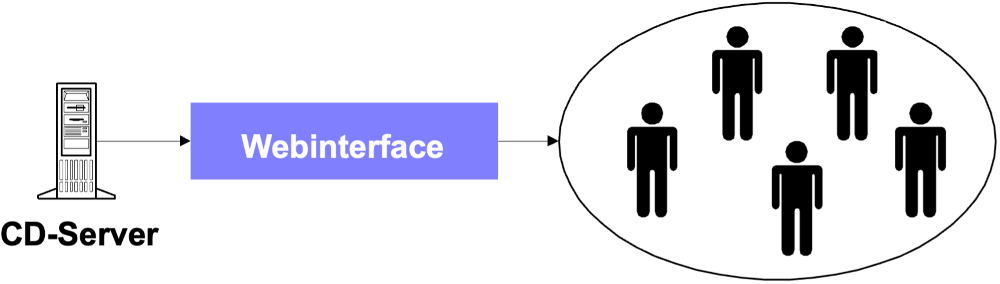
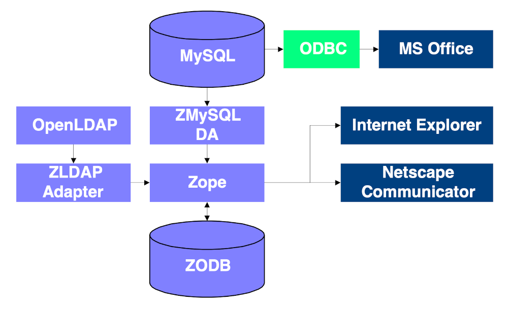

# Kurzfassung {-}
Die vorliegende Arbeit beschäftigt sich mit dem Thema Wissensmanagement aus technischer und sehr pragmatischer Sicht. Im Rahmen dieser Arbeit umfasst Wissensmanagement alle Anstrengungen, die unternommen werden, um Mitarbeiter mit dem Wissen zu versorgen, das sie benötigen, um für das Unternehmen mit optimaler Effizienz tätig zu sein.

Das Ziel war, eine Plattform zu entwickeln, die im [Fraunhofer Institut für Integrierte Schaltungen](https://www.iis.fraunhofer.de), im Folgenden IIS genannt, die Funktion eines Wissensmanagementsystems übernehmen kann. Nach Analyse der Ausgangssituation und der vorhandenen Wissensquellen musste zwischen der Implementierung auf einem kommerziellen System, auf einem Open-Source-System oder der Entwicklung einer neuen Plattform entschieden werden.

Zunächst wurde die Eigenentwicklung fokussiert. Basierend auf dem Webserver Apache, der Skriptsprache PHP3, der Servletengine Jserv, der XML-Render-Engine Cocoon und der relationalen Datenbank mySQL wurde ein Prototyp erstellt. Es wurde erkannt, dass zu viel Zeit in die Entwicklung der Plattform investiert werden musste, die dann bei der Konzeption der Wissensmanagement-Methoden fehlte.

Aus diesem Grund wurde die Eigenentwicklung eingestellt und der Open-Source Application Server ZOPE als Plattform herangezogen. Dieser eignet sich insbesondere durch seine offene Architektur, seine einfache Erweiterbarkeit und die umfassende Unterstützung von Standards (SQL, LDAP, FTP, HTTP, WebDAV, SOAP, XML, XML-RPC, RSS).

Am Ende der Arbeit lag ein voll funktionsfähiger Prototyp vor, der zur Einführung von Wissensmanagement verwendet werden kann. Wichtig ist festzuhalten, dass diese Arbeit nicht als abgeschlossen gelten kann. Vielmehr müssen die Ansätze und Methoden in einem kontinuierlichen Verbesserungsprozess den Bedürfnissen angepasst werden.

Nachdem alle benutzten Applikationen entweder Open-Source oder frei verfügbar sind, eignet sich dieses Konzept auch für kleiner Firmen oder Lehreinrichtungen.

# Vorwort {-}
## Danksagungen {-}
Neben meinen Betreuern, **Prof. Dr. Heinz Gerhäuser**, **Dr. Hartmut Hess**, **Dr. Heinrich Dietsch** und **Dipl. Ing. Wolfram Straus**, gehört mein Dank der gesamten **Open-Source-Gemeinde**, die mich in Newsgroups, Mailinglisten und Mailkontakten tatkräftig unterstützt hat. Drei Personen möchte ich gesondert erwähnen.

**Norman Walsh** hat mir die Einarbeitung in das Thema XML/XSL durch das Beantworten meiner Fragen sehr einfach gemacht.

**James Clark** hat mich auf der XML-Werkzeugseite beraten und mir einen Überblick über die verfügbaren Software-Pakete ermöglicht.

Des weiteren gilt mein Dank **Christian Forster**, der mir in Sicherheits- und LDAP-Fragen immer hilfreich zur Seite stand.

## Das Fraunhofer Institut für Integrierte Schaltungen {-}
Diese Arbeit wurde im Fraunhofer Institut für Integrierte Schaltungen (IIS) in Erlangen/Tennenlohe durchgeführt. Das IIS ist eines von knapp 50 Fraunhofer Instituten in Deutschland und befasst sich mit mikroelektronischen Schaltungen und Systemen.

Viele der hier angesprochenen Details (z.B. Netzwerktopologie) beziehen sich auf das IIS und sind nicht allgemeingültig. Des weiteren verweisen einige Hyperlinks in diesem Dokument auf das Intranet des IIS und sind für den externen Leser nicht erreichbar. Es sind dies alle Links, die mit "http://www-local"beginnen.

## Über dieses Dokument {-}
Bei der Evaluierung verschiedener Softwareprodukte für die Erstellung dieses Dokuments zog ich drei verschiedene Lösungen in Betracht. Meine Entscheidung werde ich im Folgenden erläutern.

Den Gedanken, Microsoft Word als Textprozessor zu verwenden habe ich relativ schnell wieder verworfen, da das Verwalten von großen Dokumenten schwierig ist und auch die Dateigröße stark in das Verhalten von Word einfließt (Dateien mit vielen Grafiken sind sehr schwer zu handhaben).

Ein weiterer Punkt, der gegen die Verwendung von Microsoft Word sprach war das proprietäre Dateiformat, das für die Speicherung verwendet wird. Zugriff auf das Format mit anderen Werkzeugen (zum Beispiel durch das Versionskontrollsystem [CVS](https://de.wikipedia.org/wiki/Concurrent_Versions_System) ist somit nur bedingt möglich.

Das frei verfügbare Produkt LaTeX kannte ich bereits aus meiner Studienarbeit. Obwohl die Einarbeitung etwas mühselig ist, da es sich hierbei nicht um einen WYSIWYG-Prozessor ("What You See Is What You Get") handelt, steht mit LaTeX ein sehr robustes und zuverlässiges Werkzeug zur Verfügung. Besonders komfortabel lassen sich mit LaTeX wissenschaftliche Dokumente verfassen, weil es hervorragende Formelfunktionen bietet.

Da XML in meiner Diplomarbeit eine große Rolle spielen sollte, lag die Entscheidung nahe, auch ein XML-basiertes Dokumentationssystem zu verwenden, um damit erste Erfahrungen zu sammeln. Weil es sich bei XML (im Gegensatz zu LaTeX) um eine relativ neue Technologie handelt, ist die Einstiegsschwelle noch größer, da es auf dem Markt nur wenige, frei verfügbare Werkzeuge gibt.

Die Energie, die ich in die Konfiguration eines solchen Dokumentationssystems gesteckt habe (siehe Abbildung 1), möchte ich in einer kurzen Zusammenfassung bündeln.

Um in XML Dokumente erstellen zu können, wird eine Vorlage benötigt, die festlegt, welche Elemente (Tags) in dem Dokument erlaubt sind. Eine solche DTD ist [Docbook](https://docbook.org/). Sie eignet sich sehr gut zum Verfassen von technischen Dokumentationen. Formeln werden bis jetzt nicht unterstützt, sind aber mit MathML in der Vorbereitung.

In meiner Arbeit kam die Version 3.1 der Docbook DTD (in der SGML-Version) zum Einsatz. [Norman Walsh](https://nwalsh.com/people/ndw/) hat aus der SGML-Version eine XML-Version abgeleitet.

Um aus einem gültigen XML Dokument ein anderes Format zu erzeugen, werden sogenannte Stylesheets benötigt. Diese können XML beispielsweise in HTML, PDF, TeX, etc. umwandeln. Allerdings gibt es verschiedene Stylesheetformate, die sich in unterschiedlichen Standardisierungszuständen befinden.

Bei diesem Dokument habe ich mich für DSSSL und gegen XSL Stylesheets entschieden, da diese in der Standardisierung fortgeschrittener waren. Für die Docbook DTD gibt es sowohl [DSSSL-Stylesheets](https://github.com/docbook/dsssl) als auch [XSL-Stylesheets](https://nwalsh.com/docs/articles/dbdesign).

Der Prozessor hat die Aufgabe, aus einem XML Dokument unter Zuhilfenahme eines Stylesheets ein bestimmtes Ausgangsformat (zum BeispielHTML) zu erzeugen. Der zu verwendende Prozessor hängt von der Wahl des Stylesheets ab.

Kommt DSSSL zum Einsatz, so kann [Jade](http://www.jclark.com/jade/) von James Clark (mailto:jjc@jclark.com) als Prozessor verwendet werden, bei XSL stellt die Kombination aus [XT/XP](http://www.jclark.com/xml) (ebenfalls von James Clark) eine Alternative dar.

Da es sich bei XML um reines ASCII Format handelt, kann als Editor jeder beliebige Texteditor zum Einsatz kommen. Aus Komfortgründen habe ich mich für den Editor [Emacs](https://de.wikipedia.org/wiki/Emacs) entschieden, den es auch in einer Version für Windows gibt.

**TIPP:** Eine sehr gute Beschreibung, wie unter Windows NT eine freie SGML/XML Umgebung installiert werden kann (mit allen hier erwähnten Komponenten) bietet das Tutorial SGML for NT: A brief tutorial [how to set up a free SGML editing and publishing system for Windows NT](https://web.archive.org/web/20040202052857/http://ourworld.compuserve.com/homepages/hoenicka_markus/ntsgml.html).

## Konventionen {-}
Diese Sektion gibt einen Überblick über die in diesem Dokument verwendeten Konventionen.

Da es im Bereich der Internettechnologien sehr viele Abkürzungen gibt, ist es sehr unübersichtlich, jede Abkürzung direkt im Text zu erklären. Aus diesem Grund befinden sich die Erläuterungen im Glossar.

Um die Übersichtlichkeit der Textpassagen zu steigern, wird die Technik des Information Mapping angewandt (siehe [hol00]). Zu jedem logisch zusammengehörigen Absatz wird ein treffendes Schlagwort an den Seitenrand gesetzt, das die Navigation und das Nachschlagen im Text erleichtert und zur Reflexion anregt.

In vielen Fällen ist die Angabe von Internetlinks (URLs) nötig. Da aus dem Quelldokument (XML) der Diplomarbeit sowohl die Druck- als auch die Onlineversion (HTML) erzeugt wird, musste eine Entscheidung für die Präsentationsform getroffen werden. In der Onlineversion erscheint ein Link in gewohnter Form als Teil eines Satzes, auf dem per Mausklick die entsprechende Webseite göffnet wird.

In der Druckversion erscheint dieser Teil des Satzes als normaler Text, im Anschluss daran die URL in Klammern. Diese Konvention ermöglicht das Verwenden von Internetlinks in beiden Versionen.

# Einleitung
## Themenstellung
Rechnergestütztes Knowledge Management erweist sich als Herausforderung für alle gesellschaftlichen Organisationsformen, die bei der Verfolgung großer, komplexer Aufgaben räumlich und zeitlich flexibel operieren. Mit vorhandenen Werkzeugen sind Einschränkungen vorhanden, die Akzeptanz und Effizienz beschneiden.

In kritischer Distanz zum Stand der Technik soll ein Konzept für das Wissensmanagement in einer im Informationstechnologie-Sektor angesiedelten Hochtechnologie-Einrichtung erarbeitet werden.

Neben der Gestaltung der Funktionalität (Berücksichtigung heterogener Plattformen, Nutzung vorhandener Component Ware) ist der Entwurf einer geeigneten, vorzugsweise individuell gestaltbaren Mensch-Maschine-Schnittstelle, die alle Anwender zur Nutzung motiviert, wichtiger Bestandteil der Aufgabenstellung.

Schnittstellen zu anderen Disziplinen (zum Beispiel Psychologie, Künstliche Intelligenz) sind zu identifizieren. Am Ende der Arbeit soll ein in der Praxis einsetzbarer Prototyp stehen, der alle Eigenschaften des Konzepts in sich trägt und erweiterbar ist.

## Was ist Wissensmanagement?
Der Begriff Wissensmanagement ist sehr verbreitet. Es gibt beinahe keine Zeitschrift aus den Bereichen Informatik, Informationstechnologie oder Wirtschaft, die noch keinen Beitrag zu diesem Thema veröffentlicht hat. Die Auffassungen des Begriffs selbst sind allerdings sehr unterschiedlich. Das Spektrum reicht von der Anschaffung einer Kaffeemaschine, um die interne Kommunikation zu fördern, über reine Softwarelösungen bis hin zur kompletten Restrukturierung der Unternehmenskultur.

Dieser Umstand ist Grund genug, den Begriff Wissensmanagement zumindest für den Rahmen dieser Arbeit zu definieren. Die Grundlage hierfür ist eine Begriffsdefinition des Terminus Wissen selbst, denn wie könnte eine Ressource gehandhabt werden (engl. to manage: handhaben), wenn diese nicht genau zu fassen ist?

### Wissen
Die Begriffe Zeichen, Daten, Informationen und Wissen stehen miteinander in Verbindung ([pro99]). Zeichen aus einem **definierten Zeichenvorrat** werden zu Daten, wenn sie nach festgelegten **Syntaxregeln** kombiniert werden. Wenn diese Daten in einen **Kontext** gestellt werden, so wird aus den Daten **Information**. Durch die **Vernetzung** einzelner Informationen können diese nutzbar gemacht werden. Ein solches Informationsnetz kann als **Wissen** bezeichnet werden.

Die Wissensbasis in einem Unternehmen besteht immer aus **individuellen und kollektiven Fähigkeiten** (siehe [pro99]). Um Individuum und Kollektiv in effizienter Weise zusammenzuführen, bedarf es der beiden Faktoren **Kommunikation** und **Transparenz**.

Kommunikation lässt aus Individuen ein Kollektiv entstehen (nach [rom], Kapitel 4). Die entstehende, vernetzte, kollektive Wissensbasis ist dabei größer als die Summe des Individualwissens.

Mit Transparenz ist nicht die völlige Transparenz aller in einer Organisation vorhandenen Wissenselemente gemeint. Die **totale Transparenz** führt zu einer Informationsflut, die eher **verwirrt** als weiterhilft.

Vielmehr geht es darum, Wissenselemente genau an die Stelle zu bringen, an denen sie benötigt werden. Die Wissensbasis muss also so transparent wie nötig und gleichzeitig so übersichtlich wie möglich sein.

Die Wissensdefinition, die im Rahmen dieser Arbeit gelten soll, ist ein Kompromiss aus verschiedenen Ansätzen (siehe [pro99] und [dav98]):

**Wissen bezeichnet die Gesamtheit der Kenntnisse und Fähigkeiten, die Individuen und Teams zur Lösung von Problemen einsetzen können.**

**Dieses Wissen ist eine Mischung aus Erfahrungen, Wertvorstellungen, Kontextinformationen und Fachkenntnissen, die in ihrer Gesamtheit einen Strukturrahmen zur Beurteilung und Eingliederung neuer Erfahrungen und Informationen bietet.**

### Wissensmanagement
Losgelöst von allen philosophischen Ansätzen zum Thema Wissensmanagement soll hier ein eher pragmatischer Ansatz gelten.

**Wissensmanagement umfasst alle Anstrengungen, die unternommen werden, um Mitarbeiter mit dem Wissen zu versorgen, das sie benötigen, um für das Unternehmen mit optimaler Effizienz tätig zu sein.**

Thematisiert wird sowohl die Frage nach der **technischen Plattform**, auf der dieser Informations-/Wissensaustausch stattfinden kann, als auch **Methoden** und Werkzeuge, **um den Austausch** selbst **zu erleichtern**.

### Wissensmanagementsystem
Viele Anbieter vertreiben Produkte unter dem Schlagwort Wissensmanagement, die es auch schon vor der "Wissensmanagementwelle"gab. Dazu gehören insbesondere Dokumentenmanagementsysteme, Groupware/Kollaborationssysteme, Suchmaschinen, Workflow- und Intranetsysteme.

Den Grund hierfür liefert eine Studie des Marktforschungsinstituts [IDC](https://www.idc.com) vom September 1999. Dieser Studie zufolge wird der **Markt für Wissensmanagementsoftware** jährlich um **40-50% wachsen** und im Jahr **2003** ein Volumen von **2 Milliarden US$** erreichen. Aus diesem Grund ist es wichtig, dass die am Markt befindlichen Systeme einer kritischen Evaluierung unterzogen werden.

Um ein Wissensmanagementsystem zu implementieren, muss ermittelt werden, welche Werkzeuge das Unternehmen benötigt. Diese Werkzeuge werden dann durch eine geeignete Kombination von Produkten zur Verfügung gestellt. Die Interoperation der Einzelprodukte durch ein standardisiertes Austauschformat (zum Beispiel XML) muss gewährleistet sein. Einen ähnlichen Ansatz beschreibt [ver99].

Im Folgenden ist unter dem Begriff Wissensmanagementsystem ein Verbund von Werkzeugen zu verstehen, mit denen Wissensmanagement, nach der bereits formulierten Definition, betrieben werden kann. Anders formuliert stellt ein Wissensmanagementsystem die technische Plattform des Wissensmanagements dar (neben der nicht-technischen, wie Fortbildungen, Seminaren, etc.).

**Wissensmanagement kann nur zu einem Teil durch die Einrichtung eines IT Systems etabliert werden** ([dav98]spricht von einem Drittel), **die restlichen Bestandteile sind Unternehmenskultur, Anreizsystem, Inhalt, Mitarbeitermotivation und weitere Faktoren** (siehe Abbildung 1-1).

## Einordnung dieser Diplomarbeit in einen Gesamtzusammenhang
Um den Beitrag dieser Diplomarbeit zum Thema Wissensmanagement am Fraunhofer-Institut für Integrierte Schaltungen (IIS) richtig einschätzen zu können, ist es wichtig, den Gesamtzusammenhang, in dem sie steht, zu kennen.

Das Thema Wissensmanagement wurde am IIS zum ersten Mal in einem Projekt mit dem [Fraunhofer Institut für Arbeitsorganisation](https://www.iao.fraunhofer.de) (IAO, Stuttgart) aufgebracht. Das IAO hatte von der Fraunhofer-Zentralverwaltung (ZV) in München den Auftrag, herauszufinden, wie man Wissensmanagement an den Instituten der Fraunhofer-Gesellschaft implementieren kann. Zu diesem Zweck sollte in Zusammenarbeit **mit drei Pilotinstituten** aus dem Fraunhofer-Verbund-Mikroelektronik ein **generischer Leitfaden** erstellt werden, der anderen Instituten bei der Einführung von Wissensmanagement eine Anleitung geben sollte.

Bei der Realisierung dieses Projekts wurden an den Pilotinstituten durch das IAO **Sensibilisierungsworkshops** durchgeführt, die die Institutsleitungen und die Mitarbeiter in die Thematik einführen und den Bedarf an den einzelnen Instituten erfassen sollten. Parallel dazu wurde ein **Prototyp auf Basis von Lotus Notes** R5 entwickelt, der die erarbeiteten Methoden unterstützen sollte. Aufbauend auf diesem Prototypen, zusammen mit dem generischen Leitfaden, sollten die Institute in der Lage sein, Wissensmanagement zu implementieren.

Nach Evaluierung des Prototypen am IIS wurde das Urteil gefällt, dass die gesamte Arbeit, bestehend aus Leitfaden und Prototyp, für das IIS nur von sehr geringem Nutzen ist und deswegen nicht weiter verfolgt werden sollte.

Eine wichtige Erkenntnis, die aus diesem Projekt gezogen werden konnte, ist, dass es sehr schwierig oder gar unmöglich ist, Wissensmanagement von außen, ohne genaue Kenntnisse der Struktur eines Unternehmens zu implementieren.

Da die Einführung von Wissensmanagement immer auch mit einem Eingriff in die Unternehmenskultur verbunden ist, ist eine Unterstützung durch die Unternehmensleitung unbedingt notwendig.

Im Rahmen dieser Diplomarbeit soll ein **Konzept** entwickelt werden, mit dem begonnen werden kann, Wissensmanagement am IIS zu implementieren. Dieses Konzept soll, im Gegensatz zum Ansatz des IAO, auf die speziellen Bedingungen am IIS eingehen. Des weiteren soll ein Prototyp entwickelt werden, der die Funktion eines Wissensmanagementsystems übernehmen kann und die Elemente des Konzepts in sich trägt.

Nach Beendigung der Diplomarbeit kann durch die Institutsleitung die Entscheidung getroffen werden, ob dieser Prototyp am IIS eingesetzt werden soll.

# Vorüberlegungen
## Rahmenbedingungen am IIS
### Heterogenes (IT)Umfeld
Am IIS sind eine **Vielzahl** der verfügbaren **Betriebssysteme** (WindowsNT, Windows95/98, Windows3.11, HP/UX, Solaris, SunOS, OS/2, MacOS, Novell, Linux) sowie eine Vielzahl von **Hardwareplattformen** (Sun, HP, PC, Macintosh, etc.) im Einsatz. Es ergeben sich Probleme, die im Folgenden beschrieben werden.

Da auf den einzelnen Plattformen die **Benutzerverwaltungen unterschiedlich** sind, müssen Daten, wie Login und Passwort, auf mehreren Systemen synchron verwaltet werden, was einen hohen Administrationsaufwand bedeutet.

Auf den Plattformen NT, UNIX und Mac sind die **Rechteverwaltungen** grundsätzlich **verschieden**. Nutzer, die auf mehr als einem System Daten verwalten, müssen Kenntnisse über mehrere Systeme haben.

Die **Supportressourcen** sind auf viele Plattformen **verteilt** und können nicht fokussiert werden. In der Praxis bedeutet das, dass zwar alle genannten Plattformen angeboten, diese aber nicht in ausreichendem Maß unterstützt werden können.

Die Bereitstellung von Speicherplatz für die einzelnen Plattformen ist schwierig (zum Beispiel Konvertierung von Rechten UNIX/NT), da die **Standards**, die bei den einzelnen Betriebssystemen zum Einsatz kommen, **nicht kompatibel** sind (zum Beispiel NFS, SMB, FAT, NTFS).

Das gleiche Bild wie bei Betriebssystemen und Hardwareplattformen bietet sich bei der im Einsatz befindlichen **Anwendersoftware**. Es gibt keine Reglementierung, die den Anwender auf bestimmte Produkte beschränkt. Da die Formate der einzelnen Applikationen in der Regel nicht austauschbar sind, ergeben sich Probleme bei der Weiterverwendung der Dateien mit anderen Softwarepaketen.

Die Wahrscheinlichkeit, dass es eine solche Reglementierung in naher Zukunft geben wird, ist gering. Deswegen muss das zu konzipierende System die bestehende Vielfalt unterstützen.

### Vorhandene Plattformen
Wie sich zeigen wird, muss eine Plattform, auf der Wissensmanagement implementiert werden soll, bestimmte Anforderungen erfüllen. Dazu gehören neben **Offenheit**, **Flexibilität** und **Sicherheit** vor allem die Eigenschaften **Plattformunabhängigkeit** (gerade im Bezug auf die vorhandene Heterogenität), **einfache Bedienbarkeit** und die **Zugriffsmöglichkeit mit Standardsoftware**.

Am IIS existieren bereits zwei Ansätze, die für eine solche Plattform in Betracht gezogen werden können, **Lotus Notes** und das Intranet (https://www-local/private) des IIS.

#### Lotus Notes
Zum Zeitpunkt der Arbeit waren über die Basisfunktionalität des Notessystems hinaus, abgesehen von einer **Adressdatenbank** und einem **Helpdesksystem**, keine Applikationen verfügbar, die allen Mitarbeitern am Institut einen Nutzen bringen konnten.

In den einzelnen Abteilungen sind teilweise in Eigeninitiative kleine Applikationen entstanden, die dort auch erfolgreich eingesetzt werden. Ein Beispiel hierfür ist ein **Software-Fehlerverfolgungssystem**, das nur mit Notes-Standardfunktionen erstellt wurde.

Ein Mitarbeiter, der einen Client installiert, muss sich zunächst einmal in die relativ komplizierte Bedienung von Lotus Notes einarbeiten.

Da Lotus Notes in der Version 4.6 eingesetzt wird, ist das Bedienen über einen Browser nur bedingt möglich. Eine sinnvolle Nutzung setzt den Notes-Client voraus.

Die Administration des Notesservers erfolgt zentral durch die Rechnerbetreibergruppe. Eigene Inhalte müssen mit ihrer Hilfe und Zustimmung auf den Server gebracht werden.

Wie bereits erwähnt, wird für die sinnvolle Nutzung von Lotus Notes ein spezieller Client benötigt. Die Installation dieses Clients erfordert die Präsenz eines Systemadministrators und cirka 20 Minuten pro Installation.

Probleme ergeben sich mit der Kompatibilität von Windows- und Mac-Clients. Die Unterstützung des Clients für die Sun-Workstation ist ab Version R5 eingestellt worden. Das **Benutzerkonzept** von Lotus Notes ist ganz anders aufgebaut, als das von Windows oder Mac. Bei der Einarbeitung muss eine sehr steile Lernkurve durchlaufen werden.

Die vom IIS auf Lotus Notes implementierten Funktionen sind **zumeist nicht dokumentiert**, was den Einstieg erschwert. Für neue Notes Nutzer gibt es keine Möglichkeit, sich schnell in das System einzuarbeiten, weil der Notes-Client nicht intuitiv bedienbar ist. Es existiert kein Einführungskonzept, mit dem die Mitarbeiter an die Nutzung von Notes herangeführt werden.

**Fazit:** Lotus Notes ist zwar sehr gut geeignet, um die Funktion eines Wissensmanagementsystems zu übernehmen. Allerdings existiert am IIS keine klare Einführungsstrategie, was die Frage aufwirft, ob Notes in einem sinnvollen Zeitraum am Institut für alle Mitarbeiter verfügbar sein wird.
Wegen der steilen Lernkurve bei Administration, Entwicklung und Nutzung ist die Einführung von Lotus Notes sehr ressourcenintensiv.

#### Intranet
Das Intranet wird bereits als **Präsentationsplattform** von verschiedenen Gruppierungen am IIS genutzt (zum Beispiel PR-Runde). Allerdings fehlen Präsentationen wichtiger anderer Gruppierungen wie beispielsweise die des Leitungskreises. Es gibt somit keinen Informationskanal, der von den Mitarbeitern zum Leitungskreis geht, außer persönlichen Emails und den Infotreffs, die in regelmäßigen Abständen statt finden.

Die Möglichkeit für Mitarbeiter oder Gruppierungen, **eigene Inhalte** einzustellen, ist **schwierig**. Zwar gibt es einen Bereich (https://www-local/private/user), in dem jeder Mitarbeiter Webseiten ablegen kann, diese werden aber nicht auf die Intranetseiten verlinkt und sind somit nur schwer zu finden.

Im bestehenden Intranet existierte bis zum Zeitpunkt dieser Arbeit **keine** Möglichkeit, auf den Inhalten eine **Volltextsuche** durchzuführen. Aus diesem Grund wurde eine Suchmaschine für das Intranet implementiert, die im oben genannten Bereich 17.000 Dokumente (davon über 3000 HTML Dokumente) festgestellt hat.

Große Teile der Informationen im Intranet sind veraltet. Im Softwarebereich sind beispielsweise Softwarepakete zu finden, für die Mitarbeiter verantwortlich sind, die schon seit Jahren nicht mehr am Institut arbeiten. Ein Grund für diesen Zustand ist darin zu sehen, dass die Verwalter des Softwarebereichs nicht mit den einzelnen Softwarepaketen arbeiten.

Die Administration des Intranets ist **zentral** organisiert. Inhalte können nur in Absprache mit den Administratoren eingestellt werden, was die Einstiegsschwelle, eigene Inhalte einzubringen, erhöht.

Der große Vorteil des Intranets ist die einfache Bedienbarkeit mit einem **Standardbrowser**. Derartige Browser sind auf beinahe allen Rechnern installiert. Die Verbreitung von speziellen Clients ist nicht nötig, was eine enorme **Ressourcenersparnis** darstellt.

**Fazit:** Das Intranet bietet den Vorteil, dass die dort verfügbaren Inhalte für alle Mitarbeiter zugänglich sind. Leider ist die Interaktion mit dem Nutzer und das Einstellen eigener Inhalte bisher nur bedingt möglich und macht so den bisherigen Ansatz des Intranets für ein Wissensmanagementsystem unbrauchbar.

## Wissensformen
Bei Wissensformen kann man grundsätzlich zwischen explizitem und implizitem Wissen unterscheiden (Polanyi, Michael. The Tacit Dimension. London: Routledge & Kegan Paul).

Explizites Wissen (explicit knowledge) kann in Sprache ausgedrückt und zwischen Individuen transferiert werden. Als Vereinfachung ist unter explizitem Wissen das Wissen zu verstehen, das in Form von Dokumenten, Anleitungen, etc. erfasst werden kann.

Im Gegensatz dazu ist implizites Wissen (tacit knowledge) immer an Personen gebunden und ergibt sich aus deren persönlicher Erfahrung, Perspektive und Wertvorstellungen.

Implizites Wissen ist immer an Menschen oder Gruppen von Menschen gebunden. Der Übergang von implizitem zu explizitem Wissen kann zum Beispiel durch Dokumentation vollzogen werden.

### Explizit
#### Bücher
Bücher sind nach wie vor eine der wichtigsten Quellen für Wissen. Zu beinahe allen Themengebieten gibt es **Standardwerke**, die in dieser Ausführlichkeit und fachlichen Tiefe nicht im Internet zu finden sind.

Am IIS gibt es eine hauseigene Bibliothek (https://www-local/private/iisinfo/bib), die sowohl einen **Präsenzbestand** pflegt als auch für die **Beschaffung** von neuen Büchern verantwortlich ist. In den Intranetseiten der Bibliothek besteht die Möglichkeit, den Bestand abzufragen.

Das Suchinterface (http://www-local/private/cgi-bin/buchneu.pl) lässt detaillierte Abfragen nicht zu und schließt Zeitschriften nicht mit ein. Sinnvoll wäre die Einbindung der Datenbank in ein globales Suchinterface, das gleichzeitig auch in Diskussionsgruppen, FAQs, etc. suchen kann.

Eine weitere Verbesserung wäre die Erfassung von **weiterführenden Informationen** zu Büchern und Zeitschriften. So könnte jeder Mitarbeiter, der ein Buch benutzt, Beurteilungen, Hinweise auf Links, Artikel und weitere Bücher empfehlen.

Des weiteren verfügt das Institut über einen CD-Server (http://cdserv03), auf dem die Jahrgangs-CDs einiger Zeitschriften verfügbar sind (zum Beispiel Microsoft Developper Network). Dieses Angebot sollte im Bereich der Fachliteratur und der Jahrgangs-CDs verschiedener Zeitschriften ausgebaut werden und um ein Suchinterface erweitert werden.

**Fazit:** Das existierende Angebot der IIS Bibliothek ist gut aber ausbaufähig. Insbesondere sollte die Verbesserung des Suchinterface und die Einbindung von Zeitschriften angedacht werden. Zu den Ressourcen wäre eine Erfassung von Metadaten und die Möglichkeit, Kommentare bzw. weiterführende Informationen abzulegen, sinnvoll.

#### Dokumente
Einen großen Anteil an der Wissensspeicherung haben Dokumente in elektronischer und in Papierform.

Ein Dokumentenmanagementsystem, das den Mitarbeitern viel Arbeit bei der Verwaltung und dem Auffinden von Dokumenten abnehmen könnte, ist am IIS nicht im Einsatz. Ein solches ist in der Lage, **elektronische Dokumente** und **Papierdokumente** zu verwalten. Im Bereich der Dokumentenverwaltung ergeben sich aus der vorhandenen Heterogenität einige Schwierigkeiten, die im Folgenden genannt werden (siehe Abbildungen 2-1 und 2-2).

Es ist sehr schwer, Speicherplatz zur Verfügung zu stellen, der von allen Plattformen aus mit den gleichen Rechten benutzt werden kann. Das führt dazu, dass Transferverzeichnisse im Einsatz sind, auf die alle Mitarbeiter Lese- und Schreibrecht haben. Sowohl aus Sicherheits- als auch aus Administrationssicht ist diese Lösung ungeeignet.

Durch die Vielzahl der im Einsatz befindlichen Softwarepakete können Standardvorlagen nicht ausreichend unterstützt werden. Folglich wird durch die Mitarbeiter viel Energie in die Entwicklung von brauchbaren Vorlagen gesteckt, die dann allerdings nicht öffentlich zur Verfügung stehen, sondern auf den Rechnern der einzelnen Mitarbeitern verbleiben.

Den Mitarbeitern wird für das Erstellen Ihrer Dokumente kein Softwarepaket nahegelegt. Daraus ergibt sich das Problem, dass beispielsweise ein Bericht mit den unterschiedlichsten Programmen verfasst werden kann und dann in einem Format vorliegt, das von anderen nicht gelesen werden kann. Die **Wiederverwendbarkeit** von Dokumenten wird dadurch **stark eingeschränkt**. Im Einsatz sind Microsoft Office, Staroffice, Framemaker, Lotus Notes, Pagemaker und LaTeX.

Die **Dokumentenablage** ist **nicht genormt** oder vorgeschrieben. Das führt dazu, dass jeder Mitarbeiter seine Dokumente nach eigenen Schema benennen und ablegen kann. Zusatzinformationen (Metadaten) zu den Dokumenten (Autor, Datum, Version, Abstract) werden nicht erfasst.

**Fazit:** Ein Dokumentenmanagementsystem kann die Grenzen von Plattformen durchbrechen und den Dokumentenbestand transparent und nutzbar machen. Parallel zu einem solchen System müssen Regeln eingeführt werden, wie Dokumente einzustellen und welche Metainformationen (zum Beispiel Abstract) anzugeben sind.

**Notiz:** Dokumentenmanagement ist sehr umfassend und deswegen bei dem hier konzipierten System nicht berücksichtigt worden. Aus der Vielzahl der verfügbaren Produkte sollte eines ausgewählt werden, das sich problemlos in andere Anwendungen integrieren lässt. Weitere Informationen zur Vorgehensweise finden sich [im Intranet Design Magazine](https://web.archive.org/web/20001205030600/http://idm.internet.com/features/docmgmt9b-1.shtml).

#### Newsgruppen, Maillisten und Diskussionsforen
Von diesen drei Werkzeugen sind am IIS hauptsächlich Maillisten im Einsatz. Da aber alle genannten Werkzeuge sehr mächtig sind, werden sie hier im Einzelnen betrachtet.

##### Newsgruppen (Usenet)
Das Usenet ist relativ unbekannt, obwohl aus diesem großer Nutzen gezogen werden kann. Deswegen zunächst ein Überblick über die Eigenschaften des Usenet.

- Mehr als **35000** themenbezogene **Diskussionsgruppen**
- **Weltweite Vernetzung** aller Newsserver, dadurch Zugriff auf große menschliche Ressource
- **Zugriff** ähnlich **einfach** wie das Verwenden von Email
- Durch die weltweite Vernetzung und die **große Nutzerzahl** (cirka 100 Millionen) sehr kurze Antwortzeiten
- Durchsuchen aller bisher gestellten Fragen möglich, über **Archiv-Dienste** wie beispielsweise [Dejanews](https://de.wikipedia.org/wiki/Deja_News)

Die Hierarchie der Newsgruppen ist für den Einsteiger unübersichtlich, da es eine **themenorientierte Hierarchie** gibt (zum Beispiel comp.*für Computer-Themen), aber auch eine **geographische** (zum Beispiel "de.*für deutsche Newsgruppen).

**Tipp:** Nahezu jeder Mitarbeiter am IIS ist mit allem ausgestattet um das Usenet zu nutzen. Sowohl der Netscape Navigator als auch Outlook Express können mit Newsservern kommunizieren. Der IIS-Newsserver heisst news.iis (bereits voreingestellt in Netscape) und antwortet auf dem Port 119. Wer die Hierarchie der Newsgruppen unübersichtlich findet, kann bei W3C (URL nicht mehr funktionsfähig) eine Übersicht finden.

**Tipp:** Zu den meisten Softwarepaketen gibt es eigene Newsgruppen, so auch für das CAD-Paket Cadence (news://comp.cad.cadence).

##### Maillisten
Wie erwähnt, werden Maillisten am IIS seit einiger Zeit verwendet (Eine Übersicht der existierenden Gruppen findet sich im Intranet (http://www-local/private/sysadmin/mail/listen.html)). Als **Listserver** ist das Paket [Majordomo](https://de.wikipedia.org/wiki/Majordomo) im Einsatz.

Die Funktion eines solchen Listservers ist einfach. Jede existierende Liste hat eine Mailadresse (zum Beispiel iis-all@iis (mailto:iis-all@iis.fhg.de)) und eine Anzahl an Mitgliedern. Jede an die Adresse einer Liste geschrieben Mail wird an alle Mitglieder der Liste per Mail weitergeleitet. Daraus ergeben sich gegenüber Onlinediskussionsforen signifikante Nachteile.

Die **Darstellungsmöglichkeiten sind eingeschränkt**, da nicht jeder Mailclient HTML-Mails darstellen kann. Infolgedessen ist die **Darstellungsform auf** reinen **Text beschränkt**. Grafiken, Tabellen, etc. sind nicht möglich.

Ein **Archiv** der Liste ist **nicht verfügbar** (siehe Abbildung 2-3). Jedes Listenmitglied entscheidet selbst, ob es die Mails der Liste aufhebt oder nicht. Neue Listenmitglieder haben keine Möglichkeit, auf frühere Mails zuzugreifen.

Die **Weiterverwendung** der Inhalte (zum Beispiel um eine FAQ zu erstellen) ist **nur bedingt möglich**.

##### Diskussionsforen
Ein Diskussionsforum bietet die Möglichkeit, Diskussionen zu bestimmten Themen online zu führen. Es ist möglich, die Diskussionsinhalte per Email zu verschicken.

Alle Beiträge werden in einer Datenbank abgelegt und stehen somit für eine Weiterbearbeitung zur Verfügung.

**Fazit:** Das Usenet kann als eine externe, kostenlose Ressource betrachtet werden. Durch die Einrichtung von Onlinediskussionsforen können signifikante Verbesserungen im Bereich Kommunikation und Sicherung der Diskussionsinhalte erreicht werden.

#### Zeitschriften, Zeitungen
Einige Bemerkungen zu Zeitschriften wurden bereits im Abschnitt über Bücher gemacht. Weiterhin ist festzustellen, dass der sogenannte Zeitschriftenumlauf, bei dem einer Zeitschrift eine Verteilerliste angehängt und diese dann auf die Reise durch das Institut geschickt wird, ineffizient sein kann.

**Zeitschriften erreichen** den **Mitarbeiter**, der weit hinten auf der Verteilerliste steht, oftmals sehr **spät**. Eine Größenordnung von einigen Monaten ist keine Seltenheit. Dies liegt daran, dass Zeitschriften oftmals für lange Zeit bei einzelnen Mitarbeitern verweilen. Andere können nicht mitverfolgen, wo sich die Zeitschriften momentan befinden.

Wissen, das ein einzelner Mitarbeiter aus Artikeln gewinnt (zum Beispiel über die Relevanz des Artikels), wird nicht erfasst. Außerdem können weitere Informationen zu den Artikeln, die ein Mitarbeiter zum Beispiel durch eine Recherche im Internet zu einem Artikel macht, nicht aufgenommen werden.

Der Inhalt der Zeitschrift ist erst in dem Moment bekannt, in dem die Zeitschrift bei dem Mitarbeiter eintrifft. Es besteht keine Möglichkeit, über Titel und Zusammenfassung den persönlichen Wert der Zeitschrift abzuschätzen.

**Fazit:** Folgendes Modell könnte bei den Zeitschriftenumläufen eine Verbesserung ergeben: Jeder Umlauf bekommt einen **"Manager"**, der die Zeitschrift zuerst erhält. Er macht zum Beispiel alle **Artikeltitel Online** verfügbar. Damit kann jeder Umlaufteilnehmer die Relevanz der Zeitschrift abschätzen. Über dieses Onlineangebot können dann auch Kommentare zu den einzelnen Artikeln abgegeben oder weiterführende Informationen erfasst werden. Nur wer wirklich an einem der Artikel interessiert ist, erhält die Zeitschrift. Der Umlauf wird von einer Bring- zu einer Holschuld.

#### CDROM
Viele Informationen liegen mittlerweile multimedial auf CDROM vor. Eine gute Möglichkeit, diese zu veröffentlichen, stellen sogenannte CD-Server dar (siehe Abbildung 2-4), welche unterschiedliche Mengen von CD’s aufnehmen und diese im Netzwerk zur Verfügung stellen können.

Am IIS sind einige CD Server im Einsatz. Es besteht allerdings bisher keine Möglichkeit strukturiert auf den Inhalt der Server zuzugreifen. Der **Inhalt** der Server ist **nicht dokumentiert**.

**Fazit:** CD-Server sind gut geeignet, um Software oder Archiv-CDs aufzunehmen. Der Inhalt dieser Server sollte transparenter gemacht werden.

#### Software-Code
Softwarecode enthält, wenn er richtig dokumentiert ist, sehr viel **Wissen über Programmiertechniken und Problemlösungen** und kann gegebenenfalls auch gut wiederverwendet werden.

In vielen Fällen ist es sinnvoll, für bestimmte Funktionen Bibliotheken mit **getesteten Modulen** institutsweit zur Verfügung zu stellen. Dadurch muss zum Beispiel nicht jeder Mitarbeiter oder Diplomand sich seine eigenen Frequenzanalysatoren unter Matlab programmieren, sondern kann seine Energie darauf verwenden, bestehende Lösungen zu verwenden und zu verbessern.

Sehr wichtig, um den Verlauf eines Softwareprojekts verfolgen zu können, ist die Versionskontrolle. Diese stellt sicher, dass zu jedem Zeitpunkt des Projekts Zugriff auf ältere Versionen gewährleistet ist und deren Funktionalität mit den neuen Versionen verglichen werden kann.

**Tipp:** Ein sehr bewährtes Versionskontrollsystem ist CVS. Für dieses System stehen auch auf der Windowsplattform komfortable Werkzeuge wie WinCVS zur Verfügung. Um CVS-Funktionalität auch über das Web bereitzustellen, kann [CVSWeb](https://people.freebsd.org/~fenner/cvsweb/) verwendet werden.

**Tipp:** Mit CVS können nicht nur Softwarecodes verwaltet werden, sondern alle Arten von Projekten, die mit ASCII-Dateien arbeiten. Diese in XML verfasste Diplomarbeit wurde mit CVS verwaltet.

#### Briefe, Email
Briefe und Emails haben einen ganz beachtlichen Anteil am Kommunikationsaufkommen und sind damit wichtige Wissensträger.

In diesem Zusammenhang ist es sehr wichtig, Briefe und Emails, die einen bestimmten Personenkreis betreffen, für diesen zugänglich zu machen. Am IIS ist mit der Kundenkontaktdatenbank auf Lotus Notes Basis ein erster Anfang gemacht. Dieses Werkzeug steht allerdings nur einem kleinen Teil der Mitarbeiter zur Verfügung.

Mit Microsoft Outlook als Mailclient ist es beispielsweise sehr einfach möglich, den gesamten Mail und Briefverkehr automatisch mit zu protokollieren. Im Adressbuch besteht dann Zugriff auf die gesamte Kommunikation, die mit einer Person geführt wurde.

### Implizit
#### Erfahrung, Negativwissen
Erfahrungen sind deswegen im Bereich implizit angeordnet, da jeder Mensch seine eigene Vorgeschichte besitzt und damit auf ganz individuelle Erfahrungen zurückgreifen kann. Erfahrungen sind weiche Daten, die nicht ohne weiteres in Datenbanken oder Dokumenten abgelegt werden können.

Negativwissen im eigentlichen Sinn gibt es nicht, denn Negativwissen ist Wissen, wie man Dinge nicht macht. Dieses Wissen ist für zukünftige Entscheidungen sehr wichtig, da ungeeignete Ansätze von vornherein ausgeschlossen werden können und so ein Ziel direkt erreicht wird.

Auf der anderen Seite birgt Negativwissen aber auch eine große Problematik in sich, denn um es zu erfassen, müssen die einzelnen Mitarbeiter dazu gebracht werden, ihre **Fehler** zu **dokumentieren**. Das ist nur in einer Umgebung möglich, in der großes Vertrauen unter den Beteiligten herrscht.

Der einfachste Weg, Erfahrungen und Negativwissen nutzbar zu machen, ist, die Erfassung in den Projektablauf zu integrieren und damit als völlig selbstverständlich zu institutionalisieren (siehe Abbildung 2-5). Die meisten Projekthandbücher beinhalten die Elemente **Projektvorbereitung** (oder Kick Off) und **Projektnachbereitung** (erkennbar an Phrasen wie "...die Erkenntnisse aus dem Projekt sind zu dokumentieren und zu sichern..."). Die Sicherung der Erkenntnisse bei Abschluss eines Projekts wird oftmals aus Zeitgründen vernachlässigt.

Wenn am Ende eines jeden Projektes eine Projektnachbereitung eingeführt wird, können in dem darin enthaltenen Projektabschlussbericht Sektionen wie Was wir besonders gut gemacht haben, aber auch Welche Ansätze haben wir verworfen etabliert werden. Die Erfassung von Fehlern wird standardisiert und verliert an Brisanz.

**Fazit:** Negativwissen ist ein sehr wichtiger Bestandteil des Wissensmanagements. Die Probleme, die sich mit der Erfassung ergeben, können durch eine Integration der Erfassung in den Arbeitsablauf überwunden werden.

#### Handlungsmuster
Unter Handlungsmustern sind Prozesse zu verstehen, die in einem Menschen automatisch ablaufen, da er sie oft durchlaufen hat. Ein Beispiel für ein solches Handlungsmuster ist die Vorgehensweise bei der Recherche im Internet.

In den meisten Fällen verwenden Personen die Suchmaschine, die sie seit Beginn ihrer Internetaktivitäten verwendet haben. Die Tatsache, dass andere Suchstrategien, wie sie beispielsweise in der [Suchfibel](http://www.suchfibel.de) beschrieben werden, wesentlich effizienter sind, ist ihnen nicht bekannt. Der Punkt, an dem im Internet gesucht werden muss, hängt stark von der Art des Gesuchten ab. So gibt es neben den Suchmaschinen auch Kataloge, Mailarchive, Datenbanken, etc.

Weitere Handlungsmuster sind zum Beispiel die Dokumentenablage und die Organisation des Alltags (Zeitmanagement).

Wissensmanagement hat damit zu tun, bestehende Prozesse zu analysieren, Wissen über diese Prozesse zu gewinnen und den ganzen Prozess dann effizienter zu machen.

Eine wichtige Voraussetzung hierfür ist, den betroffenen Personen ihre Handlungsmuster bewusst zu machen und sie durch Verbesserungsvorschläge für einen **ständigen Verbesserungsprozess** zu sensibilisieren.

**Tipp:** Eine wichtige Methode in diesem Zusammenhang ist Kaizen. Unter Kaizen ist die kontinuierliche Verbesserung aller Prozesse zu verstehen, die in einer Firma oder im privaten Leben durchlaufen werden. Kaizen kommt ursprünglich von einem Japaner, der die Verbesserungsprozesse in der japanischen Wirtschaft beschreibt. Er definiert Kaizen wie folgt: "KAIZEN means improvement. Moreover, KAIZEN means continuing improvement in personal life, home life, social life, and working life. When applied to the workplace KAIZEN means continuing improvement involving everyone - managers and workers alike." Nähere Informationen zu Kaizen können beim [Kaizen Institut](https://kaizen.com) abgefragt werden.

#### Kontexte
Wie bereits erwähnt, sind Kontexte außerordentlich wichtig, um einzelne Wissenselemente in einen leicht erfassbaren Zusammenhang zu bringen. Die Frage ist, wie die Fülle an Einzelelementen zu einer Wissenslandkarte zusammengestellt werden können. In einer solchen Landkarte müssen alle Arten von Elementen zu beliebig vielen anderen in unterschiedliche Beziehungen gebracht werden.

Die größte Problematik ist die Heterogenität der Elemente. Es geht an dieser Stelle um Dokumente, Menschen, Vorgänge, Projekte, etc. **Um diese Elemente in einen Zusammenhang zu bringen, gibt es die Möglichkeit der Metadatenerfassung**.

Metadaten erfassen beispielsweise, dass ein Dokument von einem bestimmten Autor stammt und zu einem bestimmten Projekt gehört. Es kann dann nach weiteren Dokumenten des gleichen Autors oder nach ähnlichen Projekten gesucht werden. Die Schwierigkeit, die sich ergibt, ist die Definition der zu erfassenden Metadaten. Drei technische Ansätze sind besonders erfolgsversprechend.

Das **Ressource Description Framework RDF** ist ein vom W3C empfohlener Standard, um oben genannte Elemente zu beschreiben. Es **basiert auf** dem Standard **XML** und stellt eine Metasprache dar, mit der Ressourcen beschrieben werden können. Weitere Informationen gibt es [bei der Standardisierungsinstanz W3.org](https://www.w3.org/RDF).

**Topic Maps** stellt einen Standard zum Definieren von Wissenslandkarten dar, der mittlerweile ISO-genormt ([iso13250]) ist. Er bietet die Möglichkeit, alle genannten Elemente zueinander in Beziehung zu stellen und damit navigierbar zu machen. Wie auch RDF **basiert** Topic Maps auf **XML**.

**Notiz:** Leider bestand im Verlauf der Diplomarbeit aus zeitlichen Gründen keine Möglichkeit, sich mit dem Standard zu befassen. Es soll aber ausdrücklich darauf hingewiesen werden, dass es sich hierbei um eine Technik mit sehr viel Potential für das Wissensmanagement handelt. Ein möglicher und sehr vielversprechender Ansatz ist, die Ressourcen mit RDF oder Dublin Core (s.u.) zu beschreiben und deren Verknüpfung durch Topic Maps zu realisieren.

Der **Dublin Core** (DC) ist ein Set von Metadaten (15 Elemente), die es ermöglichen, eine Ressource zu beschreiben. Mit dem DC ist sowohl die Erfassung von elektronischen als auch die von klassischen Dokumenten möglich.

- TITLE: Der vom Autor gewählte **Titel**
- AUTHOR or CREATOR: **Person** oder **Organisation**, die für den intellektuellen Inhalt der Ressource verantwortlich ist.
- SUBJECT or KEYWORDS: **Schlüsselwörter** oder andere Arten der Klassifizierung. An dieser Stelle kann zum Beispiel die duale Dezimalklassifikation (DDC) zum Einsatz kommen.
- DESCRIPTION: Bei Textressourcen erscheint hier die **Zusammenfassung**, bei anderen (zum Beispiel Bildern) eine **Beschreibung des Inhalts**.
- PUBLISHER: **Organisation** oder **Person**, die die Ressource veröffentlicht hat.
- OTHER CONTRIBUTORS: Koautoren, etc.
- DATE: **Erscheindatum**
- RESOURCE TYPE: Die **Art der Ressource**. An dieser Stelle stehen vordefinierte Ressourcen.
- FORMAT: Das **Format der Ressource**. Ein Standard, der mögliche Formate beschreibt heisst **Mime Types**. Diese sind im RFC2046 definiert.
- RESOURCE IDENTIFIER: **String** oder **Nummer**, die die Ressource eindeutig beschreibt. Im Fall von Onlinedokumenten steht hier die URL, bei Büchern die ISBN-Nummer.
- SOURCE: **Bezugsquelle**
- LANGUAGE: Verwendete **Sprache**
- RELATION: Beziehungen zu anderen Elementen. Die Art der Beziehungen sind im DC Standard noch nicht definiert. In diesem Konzept ist vorgesehen, Topic Maps als Standard einzusetzen, um Beziehungen zu definieren.
- COVERAGE: Dieser Parameter befindet sich momentan noch in der Spezifikation. Er soll temporäre Zugehörigkeiten, wie beispielsweise zu Projekten, beschreiben.
- RIGHTS MANAGEMENT: Angedacht ist einen kurzen Text oder eine URL zu erfassen, die Auskunft über die Rechte an der Ressource gibt.

## Wissenstransportkanäle
Um den Wissensfluss in einer Firma durch ein elektronisches System unterstützen zu können, müssen zunächst einmal einige Eckdaten über diesen Fluss bekannt sein. Im vorangegangenen Abschnitt wurde die Form des vorliegenden Wissens untersucht. Dieser Abschnitt widmet sich den Kanälen, auf denen das Wissen verteilt werden kann.

### Gespräche
Das persönliche Gespräch grenzt sich gegenüber eine Besprechung durch seinen informellen Charakter ab. Während bei Besprechungen meist Protokolle geführt werden und vorab eine Agenda verteilt wird, ist mit dem Begriff Gespräch das **zufällige Aufeinandertreffen** der Gesprächspartner gemeint (zum Beispiel der gemeinsame Kaffee am Morgen).

Durch das ungezwungene Zusammentreffen entsteht eine **offene** und **ungezwungene Atmosphäre**, die oft zu kreativen Ergebnissen führt.

Die Tatsache, dass zur Gesprächsteilnahme keine Verpflichtung besteht, deutet darauf hin, dass alle Teilnehmer **Eigenmotivation** zu dem entsprechenden Thema mitbringen.

In einem Gespräch kann durch den intensiven Kontakt eine **Vertrauensatmosphäre** aufgebaut werden, die wichtig ist, um eine offene Diskussion in einem kontaktlosen Medium (zum Beispiel dem Web) zu ermöglichen.

**Fazit:** Ein wichtiges Ziel des entstehenden Wissensmanagementsystems ist es, die Kommunikation zwischen den Mitarbeitern zu fördern. Die Kontaktaufnahme mit Wissensträgern soll erleichtert werden.

### Besprechungen
Einige Eigenschaften der Besprechung wurden bereits in der Sektion Gespräche erwähnt. Um Besprechungen aus Wissenssicht effizient zu gestalten, sollten einige Punkte beachtet werden.

Der **Versand einer Agenda** (Vorankündigung der Besprechung) **an alle Teilnehmer** bietet den Vorteil, dass sich alle Teilnehmer bereits auf die Themen einstellen können und grundlegende Fragen nicht erst in der Besprechung geklärt werden müssen.

Das protokollarische Festhalten der Besprechungsergebnisse in schriftlicher Form hat den **Vorteil**, dass Personen, die nicht an der Besprechung teilgenommen haben, **schnell Einblick** in die Ergebnisse bekommen können. Außerdem kann das Protokoll als **schriftliche Zieldefinition** aufgefasst werden, die zur Kontrolle der Zielerreichung herangezogen werden kann.

**Fazit:** In einem Wissensmanagementsystem sollte der Besprechungsprozess unterstützt werden. Das kann dadurch geschehen, dass im System eine Agenda erstellt werden kann, die dann per Email verschickt wird. Diese Agenda bietet auch das Grundgerüst für das zu erstellende Protokoll.

### Seminare
Seminare sind ein vielgenutztes Werkzeug der Weiterbildung am Institut. Es existieren Seminare zu fachlichen und nicht fachlichen Themen. Seminare sind meist nach dem Prinzip des Frontalunterrichts aufgebaut und regen damit nur bedingt zur Interaktion an.

Seminare werden meist durch externe Seminarveranstalter durchgeführt. Es besteht momentan keine Möglichkeit, im Intranet eine komplette Seminarliste einzusehen und Seminare zu kommentieren. Eine solche Möglichkeit kann durch die Etablierung einer Metadatenerfassung eingerichtet werden.

**Fazit:** Der Wert von Seminaren kann dadurch gesteigert werden, dass jeder einzelne Seminarteilnehmer die Möglichkeit bekommt, Seminare zu kommentieren (und dadurch zu bewerten) und es somit zukünftigen Teilnehmern erleichtert wird, den Wert eines Seminars abzuschätzen.

### Vorträge
Bei den meisten regelmäßigen Besprechungsterminen werden in einem bestimmten Turnus auch Vorträge gehalten. Bei einer Abteilungsbesprechung wird beispielsweise ein Vortrag von einem Mitarbeiter vorbereitet und während der Besprechung gehalten.

Dadurch können alle Mitarbeiter der Abteilung auch über Projekte oder Techniken informiert werden, an denen sie selbst nicht arbeiten. Die Gruppen- und Abteilungsgrenzen werden mit den Vorträgen selten durchbrochen. Begleitmaterialien zu den Vorträgen (Handout, Folie, etc.) sind normalerweise nicht institutsweit verfügbar.

**Fazit:** Vorträge sind wichtig, um Wissen über Projektgrenzen hinweg zu vermitteln. Wenn die gehaltenen Vorträge zusätzlich in elektronischer Form ablegt und damit institutsweit verfügbar gemacht werden, können damit auch Abteilungsgrenzen überwunden werden.

### (Interne) Workshops

Ein Workshop grenzt sich von Seminaren und Vorträgen dadurch ab, dass sich die Teilnehmer den Inhalt teilweise selbst erarbeiten müssen (engl.: to work, arbeiten).
Ein Vorteil von Workshops ist, dass sich durch sie interne Expertennetzwerke bilden, die in ihren Interessen übereinstimmen und somit Fachwissen austauschen können.

**Fazit:** Die Durchführung von internen Seminaren und Workshops sollte so einfach wie möglich gestaltet werden, um den Wissensaustausch auf Basis dieses Mediums zu fördern.

### Email
Die elektronische Post ist ein wichtiger Kanal für den Transport von Wissen. Neben der **Kommunikation** zwischen Personen oder Gruppen von Personen, die normalerweise bidirektional abläuft, wird über dieses Medium auch unidirektionale Kommunikation (=**Broadcast**) betrieben. Das ist hauptsächlich für die **Verteilung von Protokollen** (zum Beispiel vom Infotreff, den EIL-Sitzungen, etc.) der Fall, wird aber auch für **Ankündigungen** aller Art genutzt.

Nachteil ist, wie bai Maillisten auch, die fehlende, für alle Betroffene zugängliche Archivierung der Nachrichten. Des weiteren stehen neuen Mitarbeitern die alten Mails nicht zur Verfügung.

**Fazit:** Verbunden mit dem Broadcast von Informationen per Email sind die bereits aufgeführten Nachteile. Das zu konzipierende System sollte eine alternative Möglichkeit bieten, Protokolle u.ä. publik zu machen.

### Dokumente
Die wichtigsten Eigenschaften von Dokumenten als Wissensträgern wurden bereits genannt. Es bleibt anzumerken, dass die beiden **Hauptkanäle** für die Verbreitung von Dokumenten die Email (als **Attachment**) und das **Filesystem** sind.

### Intranet
Das Intranet als Wissensträger ist am IIS **bisher weitgehend ungenutzt** und bietet großes Potential. Es gibt keinen Bereich, der die Verwaltung von Wissen in einer der angesprochenen Formen ausreichend unterstützt.

Die Intranettechnik bietet sich aufgrund ihrer **großen Verbreitung** und **Akzeptanz** an, um mit ihr ein Wissensmanagementsystem zu implementieren, das allerdings nicht nur auf statischen Inhalt zurückgreift, sondern viel Dynamik und Interaktion bietet.

**Fazit:** Das Wissensmanagementsystem soll das aktuell am IIS vorhandene Intranet ersetzen.

# Konzeption
## Anforderungen an ein Wissensmanagementsystem
Die folgenden Kriterien wurden für das Konzept eines Wissensmanagementsystems für wichtig erachtet.

### Sicherheit

Eine wichtige **Voraussetzung** für die Wissensweitergabe ist **Vertrauen**. Wissensaustausch ist eine Art Marktplatz, auf dem es (**Wissens-**)**Verkäufer**, (**Wissens-**)**Käufer** und (**Wissens-**)**Vermittler** gibt (siehe [dav98]). Die Währung auf diesem Marktplatz ist in den seltensten Fällen Geld. Vielmehr geht es um **Annerkennung**, **Status** oder die **Hoffnung auf Gegenleistung**. Damit einzelne Wissensgeber nicht durch Nutzer des Systems übervorteilt werden, müssen bestimmte Sicherheitsmaßnahmen getroffen werden.

Um zu gewährleisten, dass das System nicht missbraucht werden kann, ist es erforderlich, dass sich die Nutzer gegenüber dem System autorisieren müssen (im Gegensatz zum bestehenden Intranet), um bestimmte Aktionen durchführen zu können (zum Beispiel das Einstellen von Dokumenten).

Um redundante Datenhaltung zu vermeiden, ist es sinnvoll, an die bereits bestehende Nutzerverwaltung anzuknüpfen. Dafür muss sich das System an die Userverwaltung von NT (zum Beispiel über SMB), UNIX (zum Beispiel passwd, NIS), Lotus Notes oder neuere Standards (zum Beispiel LDAP) anbinden lassen.

In dem System muss immer klar erkennbar sein, wer Urheber eines Elements ist und wer Zugriff auf einzelne Elemente hat. Während es in einem Wissensmanagementsystem die Regel sein sollte, dass die meisten Elemente frei zugänglich sind, gibt es Einzelfälle, in denen die Möglichkeit bestehen muss, einen bestimmten Bereich für einen autorisierten Personenkreis zugänglich zu machen.

**Fazit:** Vertrauen durch Sicherheit aufzubauen ist eine wichtige Aufgabe des Wissensmanagementsystems. Zugriffsrechte und Systemnutzer müssen zu jedem Zeitpunkt transparent sein.

### Plattformunabhängigkeit
Plattformunabhängigkeit ist ein sehr wichtiger Aspekt für ein Wissensmanagementsystem am IIS. Wie bereits beschrieben, ist das Umfeld sowohl aus Software- als auch aus Hardwaresicht sehr heterogen, was die Beschränkung auf eine Plattform unmöglich macht.

Die effizienteste Lösung ist in diesem Fall die Webtechnologie. **Webbrowser** sind **auf jeder Plattform** standardmäßig **verfügbar**. Zusammen mit Techniken wie Javascript und Cascading Stylesheets (CSS) bietet sich die Möglichkeit ein umfangreiches und zugleich mächtiges Werkzeug anbieten zu können.

**Hinweis:** Die Verwendung von Java in Form von Java-Applets wurde ausgeschlossen. Es entsteht bei der Übertragung des Javacodes vom Server an den Client eine lange Ladezeit. Außerdem sind die virtuellen Javamaschinen, die im Client verwendet werden, um den Code auszuführen, auf den einzelnen Plattformen nicht identisch implementiert, so dass die Anforderung der Plattformunabhängigikeit nur bedingt erfüllt ist.

### Plattformunabhängigkeit
Plattformunabhängigkeit ist ein sehr wichtiger Aspekt für ein Wissensmanagementsystem am IIS. Wie bereits beschrieben, ist das Umfeld sowohl aus Software- als auch aus Hardwaresicht sehr heterogen, was die Beschränkung auf eine Plattform unmöglich macht.

Die effizienteste Lösung ist in diesem Fall die Webtechnologie. Webbrowser sind auf jeder Plattform standardmäßig verfügbar. Zusammen mit Techniken wie Javascript und Cascading Stylesheets (CSS) bietet sich die Möglichkeit ein umfangreiches und zugleich mächtiges Werkzeug anbieten zu können.

**Hinweis:** Die Verwendung von Java in Form von Java-Applets wurde ausgeschlossen. Es entsteht bei der Übertragung des Javacodes vom Server an den Client eine lange Ladezeit. Außerdem sind die virtuellen Javamaschinen, die im Client verwendet werden, um den Code auszuführen, auf den einzelnen Plattformen nicht identisch implementiert, so dass die Anforderung der Plattformunabhängigikeit nur bedingt erfüllt ist.

### Einfache, intuitive Bedienbarkeit

Bei vielen modernen Systemen fällt die Einarbeitung schwer, da sich der Nutzer an ein neues Interface, neue Funktionen, etc. gewöhnen muss. Lotus Notes am IIS ist dafür ein gutes Beispiel. Da es für das Institut keine angepasste Lösung gibt, steht ein neuer Nutzer einer Vielzahl von Funktionen in Form von Buttons, Menüs, etc. gegenüber, deren Nutzen für ihn nicht sofort erkennbar ist.

Es fällt schwer, den persönlichen Nutzen durch das System abzuschätzen und die Gefahr, dass das **Interesse nachlässt**, ist groß.

Das Benutzerinterface in diesem Konzept soll so gestaltet werden, dass sich jeder Nutzer schnell zurechtfindet und seinen Nutzen einschätzen kann. Diese Eigenschaft soll dadurch erreicht werden, dass der Nutzer in allen Bereichen des Systems eine ähnliche Umgebung vorfindet und verschiedene **Elemente**, wie zum Beispiel das kontextsensitive Menü, **immer an der gleichen Stelle** zu finden sind.

**Sparsame Verwendung von Farbe** und **Zuordnung von Symbolen** zu bestimmten Bereichen erhöht den Komfort beim Navigieren. Bestimmte Elemente, wie globales Menü und Suchfunktion, sind in jeder Ansicht vorhanden.

### Erweiterbarkeit, Flexibilität
Ebenso, wie sich das zu verwaltende Wissen verändert, muss auch das System in der Lage sein, sich anzupassen. Dies betrifft sowohl die verwalteten Inhalte als auch die Struktur und die Darstellung, in der diese präsentiert werden. Es muss die Möglichkeit bestehen, das System sehr einfach um benötigte Funktionen zu erweitern.

Weiterhin muss sich das System durch den Anwender an dessen Bedürfnisse anpassen lassen. Diese Anforderung bedingt, dass eine Technik zum Einsatz kommt, die eine **Trennung von Inhalt, Logik und Layout** zulässt. Somit kann der Benutzer beispielsweise das Aussehen seines Bereichs völlig neu gestalten, wobei die Inhalte identisch bleiben.

### Logisch strukturiert
Für die Navigation in den Wissenselementen ist eine unterliegende logische Struktur (Wissenslandkarten) unbedingt nötig. So lange nur geringe Datenmengen zu handhaben sind, erweist sich die Volltextsuche als ausreichend. Vergrößert sich aber der Datenbestand, so muss auch eine strukturierte Navigation oder eine Kombination aus beidem möglich sein.

Das Fehlen einer solchen Struktur führt im IIS beispielsweise dazu, dass vielen Mitarbeitern die Onlinesammlung von Studien- und Diplomarbeiten nicht bekannt ist. Auch über ein Suchinterface sind diese Arbeiten nicht auffindbar.

Die Frage nach einem geeigneten Weg, jedes einzelne Wissenselement in einen Gesamtkontext einzubetten, wird im Rahmen dieser Diplomarbeit nicht geklärt. Eine solche Vorgehensweise muss für das gesamte IIS festgelegt werden.

Auf der einen Seite kann die Vergabe von **Kategorien** und **Schlagwörtern** vorgeschrieben werden. Dies bedingt ein **hierarchisches Glossar**, das jedes beliebige Thema erfassen kann. Ein solches Glossar stellt beispielsweise die **Dezimalklassifikation** [Dewey]](https://www.oclc.org/en/dewey.html) dar. Gerade bei fachspezifischen Themen geht allerdings auch diese Klassifikation nicht ausreichend in die Tiefe.

Die zweite Möglichkeit besteht darin, die **Verschlagwortung dem Nutzer** zu **überlassen**, was zur Folge haben kann, dass einzelne Dokumente nicht an allen Stellen auftauchen, an denen sie relevant sind.

Sinnvoller ist, die Kategorisierung bis zu einer gewissen Stufe vorzuschreiben und ab dieser Stufe freie Verschlagwortung ergänzend zuzulassen. Eine Möglichkeit für ein solches Vorgehen ist, die Verantwortlichen für die einzelnen **Kernkompetenzen** zu identifizieren (=Kernkompetenz als erste Hierarchiestufe) und diese zu beauftragen, eine **zweite Schlagworthierarchie** mit cirka 10-20 Kategorien zu definieren.

Beide Schlagworthierarchien müssen in regelmäßigen Abständen überprüft und ergänzt werden.

### Verwendung von Standards
Proprietäre Formate besitzen im Vergleich zu Standards den Nachteil, dass die Daten nur in der Applikation verwendet werden können, für die sie angelegt worden sind. Das zu konzipierende System soll konsequent auf bestehende Standards aufbauen, um diesen Nachteil zu umgehen.

Austauschformate zwischen einzelnen Applikationen wie beispielsweise XML werden sich immer mehr durchsetzen. Die Integration der bisher bestehenden Insellösungen zu einem Gesamtsystem, das auf einen einheitlichen Datenbestand zurückgreift, wird eine der entscheidenden Herausforderungen sein.

### Mit Standardsoftware bedienbar
Diese Anforderung ist eine Erweiterung der Forderungen nach Plattformunabhängigkeit und der Verwendung von Standards. Für die Bedienung des Systems müssen gängige, und damit auf jeder Plattform verfügbare, Werkzeuge ausreichend sein. Zu dem Oberbegriff **Bedienung** zählen die **Administratio**, das **Abfragen von Inhalt** als auch das **Einstellen von neuen Inhalten** (Publishing).

Für die Bedienung des zu konzipierenden Systems sollen die Produkte Netscape Communicator, Internet Explorer/Frontpage Express und das Microsoft Office ausreichend sein. Die Browser müssen mindestens in der **Version 4.x** verwendet werden, um die Präsenz bestimmter Funktionen sicherzustellen.

## Methoden
Die Methoden, die in der Konzeptionsphase in dem Wissensmanagementsystem implementiert werden, sind nur ein kleiner Teil der benötigten Methoden. Sie ermöglichen es, die Mächtigkeit des Systems zu demonstrieren, müssen aber noch um weitere ergänzt werden.

### White Page Dienst
Was für öffentliche Telefonnetze das **Telefonbuch** oder die gelben Seiten darstellen, sind im **Internet** die White Page Dienste. Ein solcher Dienst zeichnet sich dadurch aus, dass Personen nach bestimmten Kriterien gesucht werden können. So ist es beispielsweise möglich, zu einer Emailadresse auch Telefonnummer oder Adresse zu recherchieren.

In einem Wissensmanagementsystem ist es nützlich, die Informationen, die vom White Page Dienst geliefert werden, über die rein administrativen Angaben (Email, Telefon, Adresse, etc., siehe [rfc2218]) noch um wissensrelevante Informationen ,wie **Fachgebiete eines Mitarbeiters**, **Teilnahme an Projekten** oder **Fortbildungen**, zu erweitern.

Der White Page Dienst kann außerdem dazu genutzt werden, alle neuen Mitarbeiter automatisch vorzustellen. Dieser Vorgang **erleichtert** dem neuen Mitarbeiter die **Integration** und macht gleichzeitig dessen **Kenntnisse** im Institut **bekannt**.

Zu beachten ist bei einem solchen Dienst der Datenschutz. Alle Maßnahmen sind in jedem Fall mit dem Datenschutzbeauftragten abzuklären. Die beste Möglichkeit, Probleme zu umgehen, ist, dem Mitarbeiter die Entscheidung zu überlassen, ob seine Daten öffentlich verfügbar sind.

### Diskussionsforum
Für jede Gruppierung im Institut soll es möglich sein, Diskussionsforen zu bestimmten Themen einzurichten. Diese Foren sollen an bestehende Maillisten angeknüpft werden können und müssen ihre Daten in einer Datenbank abspeichern, um Weiterverwendung zu ermöglichen.

### Verwaltung von Teilbereichen dezentralisierbar
Neben der zentralen Benutzerverwaltung muss es möglich sein, in einzelnen Bereichen **lokale Rechte** zu vergeben. Der Nutzen einer solchen Möglichkeit soll an einem Beispiel verdeutlicht werden.

Der Bereich Personalentwicklung wird am IIS von einer Person betreut, die im Folgenden Person X genannt wird. Es wird also einen Bereich Personalentwicklung in dem System geben, dessen Administrator Person X ist (siehe Abbildung 3-1). Im restlichen System ist Person X ganz normaler Mitarbeiter und mit keinen Zusatzrechten ausgestattet. Person X kann ihrerseits die Verwaltung bestimmter Unterbereiche an andere Personen übertragen.

### Newssektion
Eine Newssektion soll die Möglichkeit bieten, zu bestimmten Themen Neuigkeiten zu veröffentlichen. Es muss die Möglichkeit bestehen, dass bestimmte Mitarbeiter ihre Mitteilungen **direkt veröffentlichen** können (zum Beispiel Leitungskreisprotokolle), während andere Beiträge **zuerst geprüft** werden müssen, um Missbrauch zu vermeiden. Alle Mitteilungen sollen in einem übersichtlichen Format auf der Einstiegsseite präsentiert werden.

**Pro Tag** sollten maximal **5-10 neue Beiträge** erscheinen. Beiträge, die älter als ein zu definierender Zeitraum sind, werden aus der Newssektion gelöscht, stehen aber weiterhin über eine Suchmaske zur Verfügung.

### Newssektion
Eine Newssektion soll die Möglichkeit bieten, zu bestimmten Themen Neuigkeiten zu veröffentlichen. Es muss die Möglichkeit bestehen, dass bestimmte Mitarbeiter ihre Mitteilungen direkt veröffentlichen können (zum Beispiel Leitungskreisprotokolle), während andere Beiträge zuerst geprüft werden müssen, um Missbrauch zu vermeiden. Alle Mitteilungen sollen in einem übersichtlichen Format auf der Einstiegsseite präsentiert werden.

Pro Tag sollten maximal 5-10 neue Beiträge erscheinen. Beiträge, die älter als ein zu definierender Zeitraum sind, werden aus der Newssektion gelöscht, stehen aber weiterhin über eine Suchmaske zur Verfügung.

### Privater Bereich
Jeder Mitarbeiter hat einen **eigenen Bereich**, in dem er eigene Inhalte ablegen und zusätzliche Einstellungen für sein Profil vornehmen kann.

Dieser private Bereich dient zum Einen als **Visitenkarte** des Mitarbeiters im Institut, stellt auf der anderen Seite aber auch eine **Arbeitsumgebung** für den Mitarbeiter dar, die er sich nach seinen Wünschen einrichten kann.

### Privater Bereich
Jeder Mitarbeiter hat einen eigenen Bereich, in dem er eigene Inhalte ablegen und zusätzliche Einstellungen für sein Profil vornehmen kann.

Dieser private Bereich dient zum Einen als Visitenkarte des Mitarbeiters im Institut, stellt auf der anderen Seite aber auch eine Arbeitsumgebung für den Mitarbeiter dar, die er sich nach seinen Wünschen einrichten kann.

### Möglichkeit datenbankgestützter Anwendungen
Die Erstellung neuer datenbankgestützter Applikationen und das Einrichten von Schnittstellen muss für den Endanwender so einfach wie möglich sein. Prinzipiell sollten zwei unterschiedliche Anwendungsfälle unterstützt werden.

**Daten**, die **lokal in Datenbanken** gespeichert werden (MS Access, Oracle, Filemaker, etc.), werden über einen **Synchronisationsmechanismus** in eine zentrale Datenbank übertragen. Dort stehen sie dann dem Wissensmanagementsystem zur Verfügung.

Ein Beispiel hierfür ist eine Microsoft Access Datenbank, in der Daten von Personen geführt werden, die sich für ein Praktikum am IIS interessieren. Der Verwalter dieser Liste soll in der Lage sein, nur informelle Daten zu veröffentlichen (zum Beispiel Studiengang, Vorkenntnisse,...), und persönliche Daten wie Adresse, Telefonnummer, etc. nur in seiner lokalen Datenbank zu führen.

Das Szenario **zentrale Datenbank** zielt auf Anwendungenab,bei denen man aus einem zentralen Datenbestand eine Auswahl selektieren möchte. Der Vorteil dieser Methode besteht darin, dass viele Einzelapplikationen auf einen zentralen Datenbestand zurückgreifen könne und die Notwendigkeit für mehrfache (=redundante) Datenhaltung entfällt.

Beispiel hierfür ist eine Datenbank, die Fachartikel oder Datenblätter verwaltet. Während die aufzunehmenden Daten immer gleich sind (Titel, Autor, Zusammenfassung,...), hat jeder Anwender sehr spezielle Anforderungen an seine Sicht auf die Daten. So könnte ein Mitarbeiter an allen Artikeln interessiert sein, die sich mit dem Thema UMTS befassen, während ein anderer nach Artikeln von bestimmten Autoren sucht und diese in ein Worddokument einbinden möchte.

Um derartige Anwendungen zu ermöglichen, muss für das gesamte Institut ein **Datenbankserver** eingerichtet werden, auf dem Personen oder Gruppierungen Bereiche anfordern können. Diese Datenbereiche müssen über die standardisierte **Datenbankschnittstelle ODBC** zugänglich sein (siehe Abbildung 3-2). Im Einzelfall bedeutet das, dass Daten von allen ODBC-fähigen Softwarepaketen (zum Beispiel Microsoft Word, Microsoft Excel, Microsoft Access,...) geschrieben und gelesen werden können, sofern die entsprechenden Berechtigungen vorhanden sind.

Die Notwendigkeit, neue Datenbanktechniken erlernen zu müssen, entfällt. Der Endanwender kann weiterhin in der gewohnten Umgebung arbeiten. Die Problematiken **Backup** und **Sicherheit** müssen nur einmal für den zentralen Server gelöst werden. Bei den Nutzern der Datenbank fällt kein zusätzlicher, administrativer Aufwand an.

Im System müssen **komfortable Werkzeuge** vorhanden sein, **um Daten** aus Datenbanken **abzufragen un** neue Daten **einzugeben**.

### Suchfunktionen
Das System muss die Möglichkeit bieten, auf dem kompletten Inhalt (Dokumente, HowTos, Diskussionsgruppen, etc.) **Volltextsuchen** durchzuführen. Die Verantwortlichen für die einzelnen Inhalte sollen dafür keine zusätzlichen Anstrengungen unternehmen müssen. Die **Volltextindizierung** muss automatisch verlaufen.

Die Bereiche, die indiziert werden, sollen zusätzlich durch **externe Bereiche**, wie zum Beispiel Webseiten, ergänzbar sein. Diese Eigenschaft ermöglicht es, wichtige Internetangebote in die Suche einzubeziehen.

## Systemauswahl
### Kommerzielle Systeme
#### Lotus Notes/Domino
Ein **Lotus Notes System besteht aus** einem oder mehreren **Servern** (Domino) und entsprechenden **Clients** (Notes), die auf den Server zugreifen. Die Zielsetzung dieses Systems ist die Bereitstellung einer Plattform, auf der bestimmte Dienste, unabhängig vom jeweiligen Betriebssystem der Clients, angeboten werden können.

**Im Lieferumfang** des Lotus Notes Paketes sind deswegen nur sehr **wenig Funktionen enthalten**. Zu nennen sind Mailclient, ein Kalender und Diskussionsforen. Das **System muss**, je nach Anforderungen, um die gewünschte Funktionalität **erweitert werden**.

Diese Erweiterung kann prinzipiell auf zwei Wegen erfolgen: Entweder werden **Anwendungen** auf der Notes Plattform **programmiert**, wozu die Notes Entwicklungstechniken erlernt werden müssen, **oder** es werden **Produkte** von Firmen **gekauft**, die für die Notesplattform entwickeln. Diese Produkte gibt es mittlerweile für alle in einer Firma benötigten Funktionen, wie Dokumentenmanagement, Kontaktverfolgung, Customer Care, etc.

Eigene Applikationen wurden am IIS bereits programmiert. Es entstand, in relativ langer Programmierzeit, eine **Adressdatenbank**, mit der **Kundenkontakte** verfolgt werden können. Diese Datenbank ist mittlerweile in vielen Abteilungen im Einsatz. Eine Erweiterung ist für den Endanwender kaum möglich, da hierzu Programmierkenntnisse und entsprechende Rechte notwendig sind.

Eine weitere, bereits realisierte Applikation ist das **Helpdesksystem** der Systemadministratoren. Dieses bietet die Möglichkeit, Anfragen an die Administratoren durch ein Webinterface zu erstellen.

Die Einführung und der Betrieb von Notes ist sehr **supportaufwendig**. Allein die Installation der Clients (Rollout) nimmt einige Monate in Anspruch. Die Installation der Clients ist allerdings nur ein kleiner Teil der Arbeit. Der größere Teil liegt darin, zu definieren, welche Applikationen auf der Notes-Plattform überhaupt implementiert werden sollen. Dazu muss eine ganz klare Notes-Strategie definiert sein, die mit Zielen, Ressourcen und Zeitplänen versehen ist.

Fazit: Das System Lotus Notes/Domino ist prinzipiell gut für die Funktion eines Wissensmanagementsystems geeignet. Es gibt allerdings einige Nachteile, die gegen eine Verwendung am IIS sprechen.

- Mangelnde Verbreitung von Clients: Die Zahl der Clients ist sehr gering. Das bedeutet, dass mit einem Notes-System nur ein kleiner Teil der Mitarbeiter abgedeckt wird.
- Mangelnder Support: Support für die Plattform Notes ist kaum vorhanden. Zwar besteht die Möglichkeit, einen Client installiert zu bekommen, darüber hinaus gibt es aber keine Einführung o.ä. in die Nutzung/Weiterentwicklung von Notes.
- Aufwendige Einarbeitung für Endnutzer: Ein Mitarbeiter, der bestimmte Funktionalität in Notes implementieren möchte, hat eine relativ steile Lernkurve zu durchlaufen, da es sehr zeitaufwendig ist, sich in die Notes-Technik einzuarbeiten. Auch die tägliche Benutzung des Notesclients ist nicht intuitiv möglich.
- Fehlende Strategie für die Einführung: Da es für das Produkt keine klare Einführungsstrategie gibt, ist unsicher, ob Notes überhaupt irgendwann als Plattform für alle Mitarbeiter zur erfügung stehen wird. Die Einführung zieht sich mittlerweile über mehrere Jahre, weswegen viele Mitarbeiter verunsichert sind.
- Aspekt der Plattformunabhängigkeit geht verloren: Ein wichtiger Grund für die Entscheidung für den Kauf von Notes war die Tatsache, dass Notes Clients für die meisten am IIS vorhandenen Plattformen (Windows/Mac/UNIX) bereitstellt. Ab der Version 5 (die sich im IIS bereits im Teststadium befindet) wird kein Client mehr für UNIX Systeme angeboten, was den angesprochenen Vorteil neutralisiert.

#### Microsoft Outlook/Exchange

Die Kombination aus Outlook und Exchange ist prinzipiell als **Microsoft Pendant zu Notes/Domino** zu verstehen. Als Mitglied der Microsoft Office Produktpalette ist der Outlook Client am IIS bereits für jeden Mitarbeiter lizenziert.

Der **Exchange Server** ist zwar im Microsoft Select Vertrag enthalten, aber **für** das **IIS nicht lizenziert**. Wie auch für den Betrieb eines Lotus Domino Servers ist für Exchange eine Lizenz erforderlich.

Die Kombination aus Outlook und Exchange bietet einige **Vorteile gegenüber der Notesplattform**, die im Folgenden näher erläutert werden sollen.

Durch die Zugehörigkeit zum Microsoft Office kann der **Outlook Client** wesentlich **intuitiver bedient** werden als der Notes Client. Oberflächen und Benutzerführung sind dem Office gegenüber ähnlich aufgebaut.

Die Applikationen des **MS Office** sind in Outlook/Exchange **gut integrierbar**. So ist es beispielsweise möglich, das Erstellen von Dokumenten und deren Versand oder Ablage automatisch in einem Journal zu protokollieren. Dieses Journal dient dann als Kontakthistorie für einzelne Personen. Das Verteilen von Aufgaben per Mail ist ebenso möglich wie bei Notes. Allerdings können in Outlook diese Aufgaben beispielsweise in Microsoft Project integriert werden.

Um das Outlook/Exchange System zu erweitern sind **weniger Programmierkenntnisse erforderlich** als bei Notes. So genannte Outlook Formulare können mit den Funktionen des Microsoft Office leicht erstellt und veröffentlicht werden. Das Erlernen neuer Programmiersprachen ist für einfache Erweiterungen nicht nötig.

**Fazit:** Die Kombination aus Outlook und Exchange ist sehr gut geeignet, um den Kommunikationsteil eines Wissensmanagementsystems am IIS zu realisieren. Die intuitive Benutzung, die Verfügbarkeit auf Windows und Mac und die gute Integration des Microsoft Office machen es der Notes Lösung überlegen. Zu beachten ist aber auch der psychologische Aspekt. Lotus Notes ist bereits gekauft worden und wird an einigen Stellen auch verwendet. Eine mögliche Umstellung auf Outlook/Exchange wird deswegen sicherlich Reibungspunkte mit sich bringen. Die Entscheidung muss auf alle Fälle basierend auf fundierten Erkenntnissen getroffen werden.

### Open Source/Freie Systeme
#### TWIG - The Web Integration Gateway
Die beste Umschreibung für die Funktionen von [Twig](https://web.archive.org/web/20020802144703/http://twig.screwdriver.net/about.php3) ist Mini-Groupware. Die Funktionen von Twig sind hauptsächlich im Kommunikationsbereich angesiedelt. Mit den im Folgenden beschriebenen Funktionen eignet es sich eher als **kleines Internetportal** als für ein Wissensmanagementsystem.

- Email (über IMAP)
- Kontakte (in Form eines Adressbuchs)
- Termine
- Usenet Newsgruppen (NNTP)
- ToDo Listen
- Bookmarks

Als Wissensmanagementplattform für das IIS eignet sich TWIG nicht, da es über seine Funktionen hinaus nur **schwer erweiterbar** ist. Es fehlen beispielsweise wichtige Funktionen wie die Datenbankunterstützung. Da Twig komplett **in PHP3 geschrieben** ist, könnten diese Funktionen nachgerüstet werden, was allerdings sehr arbeitsintensiv ist.

#### ZOPE - Z Object Publishing Environment
[ZOPE](https://www.zope.dev) eignet sich mit seinem offenen, **objektorientierten Ansatz** und seiner **einfachen Bedienbarkeit** hervorragend als Plattform für das IIS. Die Eigenschaften dieses **Application Server** sollen im Folgenden näher beleuchtet werden.

Ein auf ZOPE basierendes System ist **vollständig webbasiert**. Das bedeutet, dass sowohl der Benutzer, der Administrator, als auch der Entwickler mit einem normalen Webbrowser auskommen. Die Installation von speziellen Clients ist (im Gegensatz zu Lotus Notes) nicht nötig und erspart viel Zeit.

Das System ZOPE kann sehr komfortabel durch sogenannte **Produkte** über den Standardumfang hinaus erweitert werden. Im Standardumfang sind oft benötigte Elemente wie Folder, Dateien, DTML-Methoden, Bilder und Indizierfunktionen enthalten.

Es gibt Produkte, mit denen man **Verbindungen zu Datenbanken** herstellen, **Umfragen** erstellen und **lokale Filesysteme einbinden** kann. Zum Zeitpunkt dieser Arbeit waren bei ZOPE **über 110** verschiedene **Produkte verfügbar**.

ZOPE unterstützt alle im Konzept geforderten Standards und darüber hinaus noch einige mehr (**HTML 4, CSS, HTTP 1.1, FastCGI, FTP, WebDAV, DOM, XML, XML-RPC, SQL, RSS, LDAP**). Besonders durch die Verwendung der Standards HTTP/WebDAV ist eine Integration in die Microsoft Office Produktpalette sehr einfach möglich.

In ZOPE können logische Funktionen durch das, von XML abgeleitete, Derivat **DTML** (Document Type Markup Language) realisiert werden. Bevor ZOPE eine Seite an einen Client überträgt, prüft es diese auf vorhandene DTML-Tags, wertet diese aus und sendet das Ergebnis an den Client. Diese Vorgehensweise ist ähnlich wie bei PHP.

In DTML existieren Befehle für die meisten benötigten Funktionen. Dazu gehören unter anderem Datenbankabfragen, der Versand von Emails und die Deklaration von Variablen. Obwohl das System ZOPE in [Python](https://www.python.org/) programmiert ist, wird der normale Entwickler im Normalfall nicht mit dieser Programmiersprache konfrontiert und kann seine Applikation vollständig in DTML implementieren.

Mit **XML Document** steht ein Produkt zur Verfügung, mit dem XML-Inhalte in das System integriert werden können. XML Document repräsentiert ein Dokument in der standardisierten **DOM API**. Über diese API können Elemente des Dokuments abgefragt, eingefügt oder verändert werden. Produkte, die ein XML Dokument in eine darstellbare Form (zum Beispiel HTML) umwandeln, stehen ebenfalls bereit.

Um beispielsweise in Lotus Notes eine Applikation zu entwickeln, muss man die Notes-eigene Programmiersprache erlernen, was mit einer steilen Lernkurve verbunden ist. Bei ZOPE ist der **Einstieg** viel einfacher möglich. Falls kein fertiges Produkt existiert, können kleine Applikationen bereits mit einfachen HTML/CGI Kenntnissen erstellt werden. Einfache Funktionen können somit maßgeschneidert durch Mitarbeiter selbst erstellt werden. Spezielle Lizenzen, wie die Notes-Entwicklerlizenz, sind nicht nötig.

Obwohl ZOPE mit einer Datenbank zusammen ausgeliefert wird, kann man prinzipiell jede **SQL Datenbank** (zum Beispiel Oracle, MySQL, Microsoft SQL) als **Datenspeicher** verwenden. Die integrierte **ZODB** (ZOPE Objectoriented Database) **bietet** allerdings einige sehr **komfortable Funktionen**, die bei Verwendung einer relationalen Datenbank fehlen.

Durch die Objektorientierung kann jeder Vorgang, wie zum Beispiel das Löschen eines Elements, rückgängig gemacht werden (**UNDO Funktion**).

Bei der Verwendung der ZODB besteht weiterhin die Möglichkeit der **Versionsverwaltung**. Hierbei kann der Entwickler eine neue Version eines Bereiches erstellen, ohne dass diese von den Nutzern des Systems abgefragt werden können. Die Nutzer sehen noch die alte Version. Erst wenn der Entwickler die neue Version freigibt, können andere darauf zugreifen.

Die Objekte in der Datenbank (ZODB) werden über ein sogenanntes **URL-Objekt-Mapping** adressiert. Dadurch kann jedes Objekt durch eine URL eindeutig angesprochen werden. Auf die Objekte können dann verschiedene Methoden angewendet werden.

Die **Vererbung** ist ein sehr mächtiges Hilfsmittel in ZOPE und ist sehr vielseitig einsetzbar. Jedes Unterverzeichnis erbt Rechte und Eigenschaften des übergeordneten Verzeichnisses. Das bedeutet, dass beispielsweise eine Person, die in oberster Ebene eine bestimmte Rolle zugewiesen bekommen hat, diese Rolle durch Vererbung auch in allen Unterverzeichnissen besitzt.

Eine weitere Anwendungsmöglichkeit der Vererbung ist, auf Toplevel allgemeingültige Objekte (zum Beispiel das Institutslogo) abzulegen. Dieses steht dann jedem Benutzer in den unteren Leveln zur Verfügung.

Prinzipiell kann die Benutzerverwaltung von ZOPE auf unterschiedlichen Wegen realisiert werden. Am einfachsten ist die in ZOPE integrierte Benutzerverwaltung, der sogenannte **UserFolder**. Dieser hat allerdings den **Nachteil**, dass jeder **Nutzer manuell eingetragen** werden muss und diese Daten außerhalb von ZOPE nicht zur Verfügung stehen.

Eine weitere Möglichkeit besteht darin, ZOPE über **bestehende Benutzerverwaltungen** wie zum Beispiel die von Microsoft Windows NT autentifizieren zu lassen. Hierzu wird ein bestimmtes Produkt (zum Beispiel NTUserFolder) benötigt. Der große Vorteil dieser Lösung besteht darin, dass mit NT bereits eine gepflegte Benutzerverwaltung am IIS vorliegt und diese unmodifiziert verwendet werden kann.

Langfristig ist allerdings empfehlenswert, alle Dienste, die Autentifizierung benötigen, aus einer **gemeinsamen Quelle** zu speisen. An dieser Stelle bietet sich **LDAP** als Standard an. Über LDAP kann nicht nur ZOPE, sondern auch Windows NT, UNIX, Dokumentenmanagementsysteme u.v.m. autentifizieren.

Besitzt eine Person auf einer Ebene Managerrecht, so kann diese Person die Benutzerverwaltung in ihrem Bereich selbst übernehmen. Ein Abteilungsleiter (als Manager seines Abteilungsbereichs) kann beispielsweise den Gruppen einen Unterbereich einrichten und festlegen, wer in seinem Bereich lesen, schreiben, bearbeiten, etc. kann.

Diese Funktion bietet sich an, wenn Personen, wie zum Beispiel Studienarbeiter, in der globalen Nutzerverwaltung noch nicht enthalten sind, aber dennoch Zugang zu einem Bereich des Systems bekommen sollen.

#### Jetspeed
Das Projekt [Jetspeed](https://portals.apache.org/jetspeed-2) beschreibt sich selbst als Enterprise Information Portal und Webbased Groupware. Die Projektwebseite lässt darauf schließen, dass es sich um einen sehr vielversprechenden Ansatz handelt. Leider wurde eine sinnvoll nutzbare Version erst am 21.03.2000 veröffentlicht, was eine Verifizierung leider nicht mehr möglich gemacht hat.

Interessant an Jetspeed ist, dass es sich um ein Projekt der sehr engagierten Apache Group, die auch den Webserver Apache entwickelt, handelt. Da auch Projekte wie JServ (Java Servlet Engine für Apache) oder Cocoon von dieser Gruppe durchgeführt werden, kann mit sehr großen Synergieeffekten in den Bereichen Java und XML gerechnet werde. Die einzelnen Projekte der Apache Group sind so ausgerichtet, dass die einzelnen Komponenten projektübergreifend eingesetzt werden können. Jetspeed unterstützt nach Aussage der Entwickler bereits viele Standards und Funktionen:

- XML
- Datenbank Benutzerautentifizierung (leider nicht über LDAP oder NT Domäne)
- Rich Site Summary (RSS)
- XML/XSL Inhalt durch Integration von Cocoon
- XML basierte Konfiguration
- Plattformunabhängig (einzige Bedingung JDK 1.1 und Servlet 2.0)
- Synchronisation mit Avantgo

#### Midgard
Von der Beschreibung her ist [Midgard](http://midgard-project.org) ähnlich einzustufen wie ZOPE. Im Gegensatz zu ZOPE ist Midgard allerdings ein **abgeschlossenes System**. Die Unterstützung für weitere externe Pakete fehlt. Außerdem ist die Unterstützung von Datenbanken sehr eingeschränkt, da **nur MySQL unterstützt** wird und auch die **Anbindung an LDAP** zum Autentifizieren **nicht möglich** ist.

Vom Funktionsumfang ist Midgard, trotz seines Untertitels Application Server Suite, eher in die Kategorie **Publishing-System** einzuordnen. Als Wissensmanagementsystem am IIS kommt Midgard aus den genannten Gründen nicht in Frage.

#### Enhydra
[Enhydra](https://web.archive.org/web/20050501054249/http://www.enhydra.org) ist ein **Application Server** mit **Java und XML** Unterstützung. Weil die Unterstützung von Enterprise Java Beans und CORBA angestrebt ist, kann sich Enhydra zu einer sehr attraktiven Lösung entwickeln.

Als Wissensmanagementsystem kommt Enhydra für das IIS nicht in Frage, da es keine Möglichkeit bietet, vorgefertigte Elemente, wie Diskussionsforen, etc. in das System einzubinden und miteinander zu verknüpfen.

#### OpenCMS
[OpenCMS](http://www.opencms.org) ist wie der Name schon andeutet ein **Content Management System**. Als solches ist es nicht auf Interaktion ausgelegt und deswegen nicht als Wissensmanagementsystem geeignet. In der Sektion "geplante Projekte"befinden sich aber dennoch einige interessante Dinge, wie beispielsweise die Unterstützung von **WML**, **LDAP** und einer **Volltextsuchmaschine**.

OpenCMS kommt als Plattform für das IIS-Wissensmanagementsystem nicht in Frage.

#### Intalio
Trotz Ankündigung für März 2000 war [Intalio](https://web.archive.org/web/20000301151011/http://www.exoffice.com/intalio.xml) am 10.04.2000 noch nicht verfügbar. Bei Intalio handelt es sich um einen Applicationserver, der einen sehr **offenen Ansatz** verfolgt.

- XML
- CORBA, DCOM
- Enterprise Java Beans
- Datenbank Backends (RDBMS, OODBMS, Directory Server)
- Sicherheit (OpenSSL, OpenCA, S/WAN)
- Standard APIs (JDBC, ODMG, JNDI)
- LDAP

Die beschriebene Funktionalität ist sehr umfassend. Deswegen sollte die Plattform Intalio nach der Freigabe einer Evaluation unterzogen werden.

Intalio kommt als Plattform für das IIS-Wissensmanagementsystem nicht in Frage.

#### Locomotive
Bei Locomotive (locomotive.org, URL funktioniert nicht mehr) handelt es sich um einen **Application Server**, der von GNU Entwicklern ins Leben gerufen wurde. Wie auch schon bei Midgard zuvor ist Locomotive nicht darauf ausgelegt, durch externe Module ergänzt zu werden, was bedeutet, dass alle Module selbst programmiert werden müssen.

Locomotive kommt als Plattform für das IIS-Wissensmanagementsystem nicht in Frage.

#### Star Office/Star Portal
Der Funktionsumfang des **Star Portal** konnte erst bei der CeBIT 2000 in Hannover abgeschätzt werden. Es handelt sich bei Star Office um ein vollwertiges Officepaket, das zusammen mit Star Portal alle wichtigen Funktionen eines **Groupwaresystems** abdeckt.

Bis zum Abschluss dieser Diplomarbeit lag von der Firma Star Division leider nur das sogenannte **Early-Access-Program** vor, das nur ausgewählten Firmen die Nutzung des Portals ermöglicht. Der Funktionsumfang dieses Produkts konnte aus diesem Grund nicht evaluiert werden.

### Eigene Programmierung
Neben bereits bestehenden Lösungen, kommerziell oder frei verfügbar, existiert die Möglichkeit, ein **System** von Grund auf **aus Einzelkomponenten** zu konzipieren. Bei dieser Vorgehensweise kann die Funktionsweise des Systems **optimal** an die Bedürfnisse der Firma **angepasst** werden.

## Entscheidung
Weil es am IIS zu Beginn dieser Arbeit keine Plattform gab, auf der man ein Wissensmanagementsystem hätte implementieren können, musste die Einführung eines neuen Systems in Betracht gezogen werden.

Da mit dem damaligen Kenntnisstand keines der verfügbaren Produkte die definierten Anforderungen erfüllte, wurde die Entscheidung getroffen, ein System zu konzipieren und von Grund auf zu programmieren. Nur für Komponenten wie beispielsweise das Diskussionsforum wurden fertige Produkte gewählt werden.

Da für das Wissensmanagementsystem noch kein Namen gewählt wurde, wird dieser erste Ansatz im Folgenden **systemX I** genannt. Bis zur Einführung sollte die Entscheidung für einen Namen getroffen werden, um das System auch im sprachlichen Gebrauch zu etablieren.

Mit dem Fortschritt der Arbeit haben sich drei entscheidende Erkenntnisse ergeben.

1. Die Bewertung der bestehenden Systeme wurde in sinnvollem Umfang durch das eigene Design erst möglich. Viele Vorteile des Systems ZOPE haben sich durch die Konzeption eines neuen Systems erst als solche herausgestellt.
2. Einige der in Erwägung gezogenen Produkte haben sich erst im Verlauf der Arbeit in eine Richtung entwickelt, die ihren Einsatz rechtfertigen.
3. Mit der eigenen Entwicklung der Plattform werden zu viele Ressourcen gebunden. Dies hat zur Folge, dass man sich den Inhalten und Methoden nicht mehr in aussreichendem Maße widmen kann.

Aufgrund dieser Entwicklung wurde die Entscheidung getroffen, sich von der Eigenentwicklung abzuwenden und die gewünschten Inhalte und Methoden auf einer bestehenden Plattform-Lösung (ZOPE) zu implementieren. Die bis dahin unternommenen Anstrengungen sind aber keineswegs nutzlos gewesen, da sie eine sinnvolle Beurteilung der bestehenden Lösungen überhaupt erst ermöglicht haben.

Dieser auf ZOPE basierende Ansatz soll im Folgenden **systemX II** genannt werden.

Viele der im ersten Ansatz definierten Methoden, wie der White Page Dienst oder die externen Suchfunktionen, konnten ohne Mehraufwand in systemX II integriert werden.

## systemX I
### Überblick
Da, wie angesprochen, die Idee, das gesamte System selbst zu programmieren, verworfen wurde, sind einige der im Konzept erwähnten Funktionen nicht realisiert worden. Diese sind mit einem Stern (*) gekennzeichnet.

Die wichtigsten Elemente des Konzepts sind der frei verfügbare **Webserver Apache** und dessen Erweiterungen (siehe Abbildung 3-3). Die Aufgabe eines Webservers ist es, Dokumente (normalerweise im HTML Format), die auf dem Server in einem bestimmten Verzeichnis liegen, über das sogenannte **HTTP-Protokoll** an einen Client (normalerweise ein HTML Browser) zu übertragen.

Die Möglichkeiten, die mit der **HTML** Sprache zur Verfügung stehen, sind **eingeschränkt**. HTML ist darauf ausgelegt, **statischen Inhalt** bereitzustellen, womit Inhalt aus Datenbanken nicht verfügbar gemacht werden kann.

Außerdem liegt mit dem **HTTP**-Protokoll ein **zustandsloses** Protokoll vor, d.h. in dem Moment, in dem der Server dem Client eine Seite geliefert hat, ist die Verbindung beendet. Es besteht keine Möglichkeit, mehrere Seitenaufrufe, die von dem selben Browser durchgeführt werden, zueinander in Verbindung zu stellen (**Session Management**).

Session Management ist wichtig, wenn beispielsweise das Verhalten der Benutzer beobachtet oder Variablen von einem Seitenaufruf zum nächsten gespeichert werden sollen.

Ein weiterer Nachteil ist die Tatsache, dass in **HTML** Seiten **keine logischen Funktionen** eingebaut werden können. Es ist nicht möglich, bestimmte Elemente der Seite in Abhängigkeit von Parametern oder Variablen anzuzeigen oder Berechnungen mit diesen durchzuführen.

Aufgrund dieser Nachteile existiert bei den meisten HTTP-Servern die Möglichkeit, die Funktionalität des Servers zu erweitern. An dieser Stelle sollen mit dem **Common Gateway Interface** (CGI), der Sprache **PHP3** und **Java Servlets** drei Möglichkeiten näher betrachtet werden.

Das **CGI** stellt eine **definierte Schnittstelle** zwischen dem HTTP-Server und Anwendungen, die ein CGI-Interface besitzen, dar. Das bedeutet, dass Applikationen, die bestimmte Funktionen bereitstellen, in beliebigen Programmiersprachen verfasst sein können. Oft verwendet werden Perl, C und **Shell-Skripte**.

Die Kommunikation zwischen HTTP Server und CGI Applikation ist einfach. Der HTTP-Server wird so konfiguriert, dass er bei der Anforderung nach bestimmten Dateitypen (zum Beispiel mit der Endung .cgi), diese nicht direkt an den Client weitergibt, sondern sie erst durch eine Applikation bearbeiten lässt (siehe Abbildung 3-4). Die CGI Applikation arbeitet die Anweisungen ab und erzeugt gültiges HTML, das dann über den Server an den Client zur Darstellung weitergereicht wird.

CGI Applikationen stellen ein mächtiges Werkzeug dar, um interaktive Webapplikationen erstellen zu können. Bei Einsatz von Perl als Interpreter besteht die Möglichkeit, Protokolle, wie XML, SQL, LDAP, IMAP, etc. einzubinden. CGIs wurden für dieses Konzept nicht ausgewählt, da es trotz der Vielzahl der verfügbaren CGI-Applikationen keine Möglichkeit gibt, einzelne Funktionen, wie Diskussionsforen oder Datenbanken, einfach zu integrieren.

Eine andere Erweiterungsmöglichkeit bietet die Sprache **PHP3**. Sie kann als **Modul** an den **Apache**-Server angebunden werden und stellt eine sehr große Auswahl an Funktionen bereit. Um einen Eindruck über den Umfang von PHP3 zu vermitteln, folgt eine Aufstellung der für dieses Konzept verwendeten Funktionen.

- Zugriff auf die meisten verfügbaren Datenbanken
- LDAP
- SMTP
- NNTP
- Session Management
- Zugriff auf Filesystem und lokale Applikationen

Mit PHP3 stehen alle Funktionen, die für die Implementierung der Webplattform benötigt werden, zur Verfügung. Aus diesem Grund wurde die Entscheidung getroffen, **PHP3** als **Basis für** das **systemX I** zu wählen.

Die **objektorientierte Programmiersprache Java** kann im System an unterschiedlichen Stellen zum Einsatz kommen. An dieser Stelle sollen die Möglichkeiten von **Java Servlets** im Gegensatz zu sogenannten **Java Applets** betrachtet werden.

Bei Einsatz von Java Applets schickt der Server dem Client ein lauffähiges Javaprogramm. Auf dem Client muss eine sogenannte **virtuelle Java Maschine** vorhanden sein, die den Javacode ausführen kann. Dieses Vorgehen ist mit Nachteilen verknüpft.

Der Javacode muss zu jedem Client geschickt werden, der eine bestimmte Seite anfordert, wodurch sich eine erhöhte Netzbelastung ergibt. Außerdem muss sichergestellt werden, dass jede mögliche virtuelle Maschine den Code in gleicher Weise interpretiert, was nicht selbstverständlich ist.

In dem vorliegenden Fall wurden verschiedene Applets, die verwendet werden können, um Baumstrukturen darzustellen, mit verschiedenen Browsern und Plattformen getestet. **Keines der Applets hat auf allen Plattformen funktioniert**.

**Java Servlets** umgehen dieses Problem. Bei einem Servlet wird der Javacode schon **auf dem Server** ausgeführt und an den Client nur noch die HTML Ausgabe übertragen. Das **verringert** den **Netzbandbreitenbedarf** und **reduziert Inkompatibilitätsprobleme**. Allerdings wird auf dem Server **mehr Rechenleistung** benötigt, da dieser den Javacode interpretieren muss, was im vorliegenden Fall mit maximal 400 Nutzern unkritisch ist.

Die Servlettechnologie wurde in das System integriert, um den Standard XML unterstützen zu können. Der folgende Abschnitt soll klären, warum dieser Anspruch in einem Wissensmanagement sinnvoll ist.

Der größte Unterschied zwischen XML und HTML besteht darin, dass bei XML die verwendeten Tags definiert werden können, wohingegen bei **HTML** auf fest **definierte Tags** (H1, P, IMG, etc.) zurückgegriffen werden muss. Mit XML können den einzelnen Elementen in einem Dokument sinnvolle menschen- und maschinenlesbare Namen zugewiesen werden.

Die **Verarbeitung** von **XML** ist aus diesem Grund auch etwas **komplizierter** als bei HTML, denn es besteht die Notwendigkeit, in einer sogenannten Document Type Definition (DTD) die möglichen Elemente, die in einem Dokument vorkommen dürfen, zu definieren.

Außerdem sind zur **Darstellung** sogenannte **Stylesheets** zu erstellen, die ein XML Dokument in eine darstellbare Form umwandeln (zum Beispiel HTML, PDF, etc.). Eine gute Einführung in XML gibt [see99]

Mit dem **Servlet Cocoon** steht ein Werkzeug zur Verfügung, mit dem man XML Dokumente auf Serverseite in andere Formate umwandeln kann. Neben der reinen Stylesheet Transformation bietet Cocoon auch die Möglichkeit Datenbanken oder LDAP Server abzufragen. Typisch für Cocoon ist der modulare Aufbau. Unterschieden werden **Producer, Processor und Formatter**.

Der **Producer** hat die Aufgabe ein XML Document bereitzustellen. Im einfachsten Fall wird ein XML-Dokument aus dem Filesystem gelesen. Es ist auch möglich, Daten aus Datenbank- oder LDAP-Abfragen in XML darzustellen. Cocoon liegen in der Basisversion einige Producer bei, die erweitert oder durch neue ergänzt werden können.

Über sogenannte **Formatting Instructions** (FI) wird Cocoon im Dokument mitgeteilt, welcher Processor verwendet werden soll. Ein Beispiel ist der XSLT Processor, der ein XML DOkument unter Verwendung eines XSL Stylesheets transformieren kann.

Der **Formatter** sorgt am Ende der Kette für die eigentliche Formatierung des Inhalts. Mit unterschiedlichen Formattern können Formate wie HTML und PDF erzeugt werden.

### Implementierung der definierten Methoden
#### Whitepage Dienst
Der Whitepage Dienst soll nicht ausschließlich als Whitepage Dienst, sondern darüber hinaus auch in weiteren Anwendungen verwendbar sein. Hiermit kann das Problem der redundanten Datenhaltung gelöst werden. Jeder Bereich, der personenbasierte Daten verwaltet, greift im IIS auf eigene Datenbestände zurück, die nicht synchronisiert werden. Dies trifft sowohl auf Verwaltungsstellen, wie die Personalstelle, als auch auf Systemadministratoren, Abteilungssekretariate, etc. zu (siehe Abbildung 3-5).

Der hier konzipierte Whitepage Dienst stellt eine **Datenbasis** zur Verfügung, die die Möglichkeit bietet, **personenbezogene Daten** aufzunehmen. Die hier definierten Attribute können bei Bedarf beliebig erweitert werden. Der Dienst beruht auf dem Standard **LDAP** und macht ihn deshalb zu einem plattform- und anwendungsübergreifenden Werkzeug.

LDAP wurde ursprünglich als Frontend zu den im Internet sehr verbreiteten X.500 Directory Servern konzipiert. Im Gegensatz zu diesen konnte LDAP über TCP/IP betrieben werden. Mittlerweile besteht bei den meisten LDAP-Servern auch die Möglichkeit, im sogenannten standalone-Mode, also ohne X.500-Backend, betrieben zu werden. Mit einem LDAP-Server sind verschiedene Anwendungen denkbar.

- Einheitliche und aktuelle Basis für viele der am IIS benötigten Erfassungen von **personenbezogenen** Daten. Dabei sind insbesondere datenschutztechnische Aspekte zu berücksichtigen.
- Bereitstellung eines **institutsweiten Adressbuchs**, das wesentlich aktueller als die im Moment verfügbaren ist, und auch Praktikanten, Studienarbeiter, etc. beinhaltet.
- Personen können nach **Fähigkeitsprofilen** gesucht werden. In das Profil können Ausbildung, durchgeführte Projekte, Fortbildungen und nichtfachliche Qualifikationen, wie zum Beispiel Sprachkenntnisse einfließen. Auch an dieser Stelle ist der Datenschutz zu beachten.
- Vorhalten der **Kontakte von abgegangenen Mitarbeitern** in einer **Alumni-Sektion**.

Prototypisch ist der Whitepage Dienst auf dem LDAP-Server **OpenLDAP** realisiert worden. Aufgrund des Standards LDAP, und besonders des **LDAP Interchange Format LDIF**, können die Daten jederzeit in einen anderen Server transferiert werden.

Jedem Mitarbeiter sind drei sogenannte **Objektklassen** zugeordnet. Eine Objektklasse ist eine Beschreibung der Parameter, die für eine Person möglich sind. Verwendet werden die standardisierten Objektklassen **person** (Stammdaten einer Person: Name, Vorname, etc.), **organizationalPerson** (Erweiterung von person um Daten, die in einer Organisation relevant sind: Raumnummer, Telefon, Email) und die selbstdefinierte Objektklasse **iisPerson**, die IIS spezifische Details festlegt.

Bereits mit diesem Prototypen ist es möglich, ein **Adressbuch** für den Netscape Navigator, Outlook Express und andere LDAP fähige Clients (zum Beispiel Eudora, pine) zur Verfügung zu stellen. Mit dem bestehenden Server war es außerdem sehr leicht möglich, die sogenannten **Netscape Roaming Profiles** anzubieten, einen Dienst, bei dem Einstellungen, Adressbuch und Bookmarks des Netscape Navigators mit dem Server synchronisiert werden können. Damit könne Nutzer beispielsweise auf Desktop-PC und Notebook auf die gleichen Ressourcen zurückgreifen.

Das Produkt **Enlist** bietet die Möglichkeit, den **LDAP-Server als ODBC Datenquelle** für anderen Applikationen, wie zum Beispiel das Microsoft Office, zur Verfügung zu stellen. Hiermit eröffnet sich für einzelne Bereiche die Möglichkeit, basierend auf SQL-Abfragen, personenbezogene Datenbestände lokal zu führen.

#### Diskussionsforum
Als Diskussionsforum kommt das Produkt **Phorum** (http://www.phorum.org) zum Einsatz. Es erlaubt die Verwaltung von mehreren Diskussionsforen durch unterschiedliche Administratoren. Außerdem besteht die Möglichkeit, Phorum über die Erweiterung **phorummail** an existierende Maillisten anzubinden.

Alle **Diskussionsbeiträge** werden in einer **SQL-Datenbank** abgelegt(MySQL oder PostgreSQL). Es besteht die Möglichkeit, sich von Antworten auf eingestellte Beiträge per Mail informieren zu lassen.

#### Newssektion
(*) Die Newssektion wurde im systemX I nicht realisiert. Es war geplant, das Produkt [PHP3 News Skript](https://web.archive.org/web/20000918032114/http://mana.landofhaze.com/downloads/news/) einzusetzen, das auf PHP3 basiert und alle Beiträge in einer MySQL-Datenbank ablegt.

#### Privater Bereich
(*) Der private Bereich unterscheidet sich vom öffentlichen nur dadurch, dass der Besitzer als Administrator fungiert und somit über die Rechtevergabe entscheiden kann.

#### Zugang über Standardsoftware
Der komplette Funktionsumfang kann wie gefordert über einen **Standard-Webbrowser** bedient werden. Die Funktionalität wurde mit den Browsern Netscape Navigator und Internet Explorer auf den verfügbaren Plattformen getestet.

Auf alle datenbankgestützten Anwendungen kann über ODBC zugegriffen ODBC werden. Hierfür wird ein **MySQL-ODBC-Treiber** und eine ODBC fähige
Datenbank (zum Beispiel Microsoft Access) notwendig.

#### Möglichkeit datenbankgestützter Anwendungen
Um datenbankgestützte Anwendungen zu ermöglichen, benötigt man einen **Datenbankserver** (**DBMS, Database Management System**). Oftmals kommen **relationale Datenbanken** zum Einsatz, die sich durch die Verwendung der standardisierten Abfragesprache **SQL** auszeichnen. Diese ermöglicht Relationen zwischen den einzelnen Tabellen einer Datenbank. In diesem Konzept wird das DBMS MySQL verwendet, da es frei verfügbar und bereits in vielen Anwendungen im Einsatz und somit getestet ist.

Um auf den Datenbestand eines DBMS zugreifen zu können, werden keine ODBC speziellen Clients benötigt. ODBC bietet die Möglichkeit, durch sogenannte ODBC-Treiber, auf DBMS zuzugreifen. ODBC wurde ursprünglich für die
Plattform Windows konzipiert, steht mittlerweile aber auch auf anderen
Betriebssystemen zur Verfügung (unixODBC, iODBC). Für MySQL existieren derartige ODBC-Treiber.

Zur Konfiguration und Administration der MySQL-Datenbank ist kein dedizierter Client notwendig, da mit phpMyAdmin ein Webinterface zur Datenbank verfügbar ist.

#### Suchfunktionen
Die Suche auf den Datenbeständen des Systems wird durch Datenbankabfragen auf der Datenbank realisiert.

Zu jedem Element werden **Metadaten** erfasst, die entsprechende Informationen über das Element liefern. Unter Metadaten versteht man Daten, die das zu erfassende Element beschreiben.

Die Erfassung der Metadaten erfolgt teilweise automatisch und teilweise manuell. Die persönlichen Daten des Autors sind beispielsweise dadurch bekannt, dass dieser sich zuvor am System angemeldet hat.

Die Art des Elements kann dadurch bestimmt werden, dass dem Autor verschiedene Vorlagen, zum Beispiel für Berichte, URLs etc., angeboten werden. Weitere Daten, wie beispielsweise Schlagworte, müssen vom Autor gewählt werden.

Die Abfragemöglichkeit der Metadaten wird durch eine **Suchmaschine für externe Daten** ergänzt. Für das System wurde das Produkt [Udmsearch](https://web.archive.org/web/20000105124849/http://mysearch.udm.net) ausgewählt. Zur Auswahl stand außerdem das Produkt Harvest der University of Colorado. Im Vergleich ist Udmsearch komfortabler zu bedienen und bietet die Möglichkeit, seine **Daten in** einer **SQL-Datenbank** und nicht in proprietärem Format zu speichern. Udmsearch besteht aus drei Teilen:

Der **Gatherer** (Sammler) **fragt Daten** über das HTTP-, FTP- oder NNTP- Protokoll von anderen Rechnern **ab**. Mit einem Gatherer kann theoretisch das gesamte Internet indiziert und ein Suchdienst, ähnlich wie [Google](https://google.com), aufgebaut werden.

Für die Ergänzung des Metadatenbestands ist es sinnvoll, den Gatherer nur auf bestimmte Bereiche anzusetzen. In dieser Arbeit wurde beispielsweise das IIS-Intranet untersucht, wobei der Gatherer auf ca 16.000 Dokumente gestossen ist, davon cirka 3000 HTML-Dokumente.

Der zweite Bestandteil ist der **Indexer** (Indizierer), der Daten, die durch den Gatherer gesammelt wurden, indiziert. Der hier verwendete Index ist ein sogenannter **Volltextindex**, das bedeutet, der Indexer untersucht, wie oft bestimmte Wörter in dem zu indizierenden Dokument vorkommen. Dazu verwendet er eine **Stoppwortliste**, mit der Begriffe wie ich, du, ist, etc. aus dem Indiziervorgang ausgeschlossen werden. Die erzeugten Daten legt der Indexer in einer Datenbank ab. Von Udmsearch werden MySQL, Interbase, Oracle, PostgreSQL, miniSQL, Solid, Virtuosu und ODBC unterstützt.

Der dritte Bestandteil von Udmsearch ist die **Schnittstelle zum Benutzer**. Da das Backend, das die Metadaten aufnimmt, aus einer Datenbank besteht, werden die Ergebnisse auf eine Suchabfrage aus Datenbankabfragen gewonnen. Die Daten aus der Datenbank stehen auch anderen Applikationen zur Verfügung. Als Schnittstellen werden **PHP3, C und Perl** Module mitgeliefert, wodurch Udmsearch auf beinahe jedem Webserver einsetzbar ist.

**Hinweis:** Von der Möglichkeit, mit Udmsearch auch Dokumente mit anderem Format als HTML zu indizieren wurde bisher noch kein Gebrauch gemacht. Es bietet sich aber beispielsweise an, die Sektion mit den Online- Studien- und Diplomarbeiten auch zu indizieren. Dafür stehen Module für die Formate PDF, Postscript und Doc (MS Word) zur Verfügung.

### Verwendete Softwarepakete
Dieser Abschnitt soll einen zusammenfassenden Überblick über alle verwendete Softwarepakete und deren Bezugsquellen bieten. Alle hier aufgeführten Pakete sind Open Source oder in der Binärversion frei verfügbar.

1. [Apache](https://apache.org/) dient als HTTP-Server
2. [JServ](https://de.wikipedia.org/wiki/Apache_JServ_Protocol) ermöglicht den Einsatz von Java Servlets unter Apache
3. [Cocoon](https://cocoon.apache.org) ein Java Servlet, das die Verwendung von XML, XSL, SQL, JDBC und LDAP mit dem Apacheserver ermöglicht
4. [MySQL](https://www.mysql.com/m) ein Datenbankserver, der sehr große Datenmengen aufnehmen kann und für den wichtige Erweiterungen existieren (zum Beispiel [ODBC-Treiber](https://dev.mysql.com/downloads/connector/odbc/), Webinterface)
5. [phpMyAdmin](https://www.phpmyadmin.net/) als Weboberfläche für den Datenbankserver MySQL
6. [UDMsearch](https://web.archive.org/web/20000105124849/http://mysearch.udm.net) ein Indizierer für Webseiten, der seine Metadaten in einer Datenbank ablegt
7. [OpenLDAP](https://www.openldap.org/) ein frei verfügbarer LDAP Directory Server
8. [PHP3](https://de.wikipedia.org/wiki/PHP#PHP_3) Sprache zum Erstellen von interaktiven Webseiten. PHP wird als Modul des Apache Webserver eingesetzt und bietet Unterstützung für viele gängige Protokolle (zum Beispiel SQL für alle gängigen Datenbanken, NNTP, POP, IMAP, LDAP, etc.)
9. [Phorum](https://www.phorum.org) Diskussionsforum auf PHP-Basis, das alle Beiträge in einer MySQL Datenbank ablegt

## systemX II
### Überblick
Wie bereits erwähnt, wurde der Ansatz, die technische Plattform für das Wissensmanagementsystem selbst zu entwickeln, nach Evaluierung und prototypischer Realisierung aus zwei Gründen wieder verworfen:

Es wurde erkannt, dass man mit den vorhandenen **personellen Ressourcen** zu viel Zeit in die Entwicklung und den Test der Plattform investieren muss und sich aus diesem Grund nicht in ausreichendem Maß um die Methoden des Wissensmanagements kümmern kann, die auf der Plattform realisiert werden sollen.

Außerdem hat sich das Open-Source-Projekt **ZOPE** in der Zwischenzeit zu einem System entwickelt, das für die Anwendung als Wissensmanagementsystem im IIS sehr gut geeignet ist. Es erfüllt alle gestellten Anforderungen und bietet die Möglichkeit, die Entwicklung des Systems an die Open-Source-Entwickler zu übertragen. Durch die große Verbreitung des Systems und die offenliegenden Quellen können Fehler sehr viel schneller gefunden und beseitigt werden.

Die konzipierten Methoden des systemX II unterscheiden sich von denen des systemX I nicht maßgeblich, obwohl der technische Ansatz ein ganz anderer ist. Der Hauptunterschied ist, dass die Arbeitsplattform aus Apache Webserver, JServ, Cocoon und der MySQL Datenbank durch ZOPE ersetzt wurde (siehe Abbildung 3-6).

### Implementierung der definierten Methoden
#### Diskussionsforum
Das Diskussionsforum kann in ZOPE mit zwei unterschiedlichen Produkten, **Confera** und **ZDiscussions** realisiert werden. Beide bieten die Möglichkeit von threadbasierten Diskussionen und den Versand von Emails. Im System werden beide Produkte vorhanden sein. **Empfohlen wird ZDiscussions**, da es eine Weiterentwicklung von Confera darstellt und für die in ZOPE integrierte Suchmaschine ZCatalog besseren Zugriff bietet.

#### Newssektion
Der Bereich für News wird mit dem Produkt [Squishdot](https://web.archive.org/web/20000815054006/http://www.squishdot.org/) realisiert. Squishdot bietet ähnliche Funktionen wie [Slashdot](https://slashdot.org/) und ist dieser Webseite nachgebildet.

Für den Einsatz am IIS sind an Squishdot einige Anpassungen vorgenommen worden. So gibt es bestimmte **Kategorien**, die alle durch ein **charakteristisches Symbol** gekennzeichnet sind (zum Beispiel Leitungskreis, Personalentwicklung, etc.). Die Verantwortlichen der entsprechenden Bereiche können in die Newssektion direkt Beiträge einstellen. So ist es dem Sekretariat des Institutsleiters beispielsweise möglich, alle Protokolle der Leitungssitzungen schnell und effizient zu verbreiten.

Mitarbeiter, die für keinen Bereich verantwortlich sind, können zwar auch Beiträge einstellen, diese müssen aber vor der **Veröffentlichung** durch den Administrator des Newsbereichs **bestätigt** werden (Review). Auf diese Weise wird eine schnelle und effiziente Weitergabe von Informationen ermöglicht und gleichzeitig dem Missbrauch vorgebeugt.

#### Privater Bereich
Wie auch schon im Konzept von systemX I unterscheidet sich der private Bereich eines Mitarbeiters von den anderen Bereichen nur dadurch, dass der **Mitarbeiter** dort **Administrator** ist. Der private Bereich ist so konzipiert, dass er eine Umgebung für die tägliche Arbeit der Mitarbeiter darstellt.

Standardmäßig ist der private Bereich für alle geöffnet und kann dadurch mit der globalen Suchmaschine erfasst werden. Ein Mitarbeiter kann aber auch bestimmte Sektionen in seinem Bereich für die Außenwelt verschließen.

#### Zugang über Standardsoftware
Genau wie im Konzept von systemX I kann das systemX II vollständig mit Webbrowser und **Standardsoftware** bedient werden. Zusätzlich zu der Möglichkeit, Inhalte über HTTP und FTP einzustellen, kann bei ZOPE das **WebDAV**-Protokoll verwendet werden.

[WebDAV](http://www.webdav.org) ist eine Erweiterung des Standards HTTP 1.1 und ergänzt diesen um Funktionen für die verteilte Bearbeitung von Dokumenten. Da es sich um einen sehr neuen Standard handelt, gibt es bisher wenig Werkzeuge, die WebDAV bereits unterstützen. Bisher sind das **MS Office 2000**, der **Internet Explorer 5.0/WebFolders** und mehrere kleine Werkzeuge verfügbar.

Notwendig für die Nutzung der Webfolders ist der Internet Explorer in der Version 5.x. Die Option Webfolders ist in der Standardinstallation nicht enthalten und muss im sogennanten **custom install** ausgewählt werden. Mit WebFolders ist es möglich, den Inhalt des Webservers wie ein normales Dateisystem zu behandeln. So arbeitet der Mitarbeiter mit seinen gewohnten Hilfsmitteln und ist ohne weitere Kenntnisse in der Lage, Inhalte auf dem Server zu administrieren.

#### Möglichkeit datenbankgestützter Anwendungen
Das Backend für die Datenbankverwaltung und die Anbindung der User über lokale Datenbanken sind aus dem Konzept von sytemX I entnommen. Da die Anforderungen genau die gleichen sind, waren keine Änderungen notwendig. Aus diesem Grund sollen im folgenden nur die Unterschiede in der Kommunikationsschicht zwischen ZOPE und dem DBMS behandelt werden.

ZOPE verwendet sogenannte **Database Adapter** (DA) um auf Datenbanken zuzugreifen. Derartige Adapter existieren für viele DBMS, wie zum Beispiel Oracle, Microsoft Access, Sybase und DB2. Der DA stellt eine Datenbankverbindung zur Verfügung, auf die andere Applikationen zugreifen können.

Um Datenbestände aus einer Datenbank abzufragen, können unter ZOPE vorhandene **SQL-Methoden** verwendet werden. Diese greifen auf einen DA zurück und führen SQL-Abfragen auf der Datenbank aus. Die Repräsentation der Daten kann durch den Anwender frei gewählt werden. Auf diese Weise lassen sich die Abfrageergebnisse in HTML-Tabellen, aber auch in XML oder anderen Formaten ausgeben.

Mit dem **SQL-Input-Wizard** können Schnittstellen zu bestehenden Datenbanken einfach eingerichtet werden. Basierend auf einem DA fragt der Wizard die Felder der Tabellen ab und erzeugt eine Eingabemaske. Diese kann dann an die individuellen Wünsche, wie zum Beispiel das Layout, angepasst werden. Der Anwender muss sich nicht mehr um den technischen Teil der Datenerfassung kümmern.

#### Suchfunktionen
Das Problem der Indizierung kann mit ZOPE sehr geschickt gelöst werden, denn es existiert ein eigenes Produkt, der **ZCatalog**, der die Aufgabe hat, Bereiche in ZOPE suchbar zu machen. ZCatalog ist sehr detailliert konfigurierbar und wird in dem Konzept verwendet, um alle Elemente des Systems zu indizieren.

Für externe Bereiche, wie zum Beispiel das IIS Intranet, wird wie in systemX I **Udmsearch** eingesetzt, um Inhalte zu indizieren. Die Inhalte werden von ZOPE über eine Datenbankverbindung zu einer MySQL Datenbank abgefragt.

In jeder Ansicht im System befindet sich die Möglichkeit eine Suche zu starten.

### Verwendete Produkte
Unter einem **Produkt** ist bei ZOPE zusätzliche Software zu verstehen, die das Gesamtsystem um bestimmte Funktionlität erweitert. Produkte können entweder von der **ZOPE Homepage** bezogen , oder selber programmiert werden. Die folgende Auflistung gibt eine Übersicht über die in systemX II eingesetzten Produkte (in alphabetischer Reihenfolge).

- Knowledge Kit
- LocalFS
- PSQInput Wizard/ZMySQLDA
- SiteSummary
- Squishdot
- TinyTable
- ZDConfera

# Durchgeführte Projekte/Verifikation
## Wissensmanagement Diskussionsforum
Um allen Mitarbeitern möglichst schnell Gelegenheit zu geben, sich zum Thema Wissensmanagement aus ihrer Sicht äußern zu können, wurde schon zu Beginn der Arbeit ein **Onlinediskussionsforum** zum Thema eingerichtet. Die **Resonanz** auf dieses Forum war **nicht groß**. Es gab ca. 5 Beiträge pro Woche von ungefähr 10 verschiedenen Mitarbeitern.

Ursache hierfür ist einerseits, dass davon ausgegangen wurde, dass das Thema Wissensmanagement an sich bereits bekannt sei (zum Beispiel aus dem Projekt
mit dem IAO). Es hat sich aber gezeigt, dass die meisten Mitarbeiter von Beteiligung
diesem Projekt noch keine Kenntnis hatten und deswegen mit den dargebotenen Informationen wenig anfangen konnten.

**Notiz:** Eine Projektbörse, in der alle durchgeführten Projekte mit einer Kurzbeschreibung aufgeführt werden, kann helfen, die Transparenz im Projektbereich zu vergrößern. Über eine Liste der teilnehmenden Mitarbeiter kann die Kommunikation angeregt werden.

Ein weiterer wichtiger Grund für die geringe Teilnahme ist darin zu sehen, dass sich die Mitarbeiter erst daran gewöhnen müssen, ihre Meinung und Kritik in dem öffentlichen Forum zu vertreten. Ein solcher Gewöhnungsprozess kann durch **Workshops** unterstützt werden, die dazu dienen, eine **Vertrauensbasis** herzustellen.

Es folgten beispielsweise auf das Webangebot wesentlich mehr Reaktionen per Email als im Forum selber. Rückfragen, ob diese Emails im Forum veröffentlicht werden können, wurden entweder nicht beantwortet oder verneint.

## Wissensmanagement-Workshops
Ein zweites Element für die Sensibilisierung der Mitarbeiter für das Thema Wissensmanagement waren die durchgeführten **Wissensmanagement-Workshops**. Die Workshops wurden in einem Turnus von **zwei Wochen** durchgeführt und hatten immer ein bestimmtes Thema aus dem Bereich Wissensmanagement.

An den Workshops haben Mitarbeiter aus verschiedenen Abteilungen teilgenommen. Die Teilnehmerzahl lag im Durchschnitt bei cirka 7 Personen.

In den ersten Workshops war deutlich zu erkennen, dass viele Mitarbeiter dem Thema Wissensmanagement gegenüber sehr skeptisch waren, da sie einen destruktiven Eingriff in ihre Arbeitsweise befürchteten.

Wichtige Aufgabe des Workshops bestand deswegen darin, den Mitarbeitern die Ziele des Wissensmanagement darzulegen und die Vorteile aufzuzeigen, die sie persönlich daraus ziehen können. Durch diese Workshops hat sich, ähnlich wie bei internen Seminaren, ein **Netzwerk von Personen** gebildet, die Interesse an dem Thema zeigen und Wissensmanagement am IIS fördern wollen.

## Mitarbeiterbefragung
Seit einiger Zeit wurde am IIS versucht, die Voraussetzungen für den Betrieb einer **Kindertagesstätte** zu schaffen. Zu diesem Zweck wurde von der Gruppe Personalentwicklung ein **Papierfragebogen** erstellt, mit dem der Bedarf am IIS erfasst werden sollte. Der Nachteil, dass bei Papierfragebogen **viel Zeit** für die **Auswertung** verwendet werden muss, wurde in Kauf genommen.

Da das systemX II sich mittlerweile in einem verwendbaren Zustand befand, wurde der Personalentwicklung angeboten, die Umfrage auf der Wissensmanagement-Plattform durchzuführen. Die **Realisierung** dauerte, ab dem Zeitpunkt der Zusage und Dank der Flexibilität von ZOPE, **zwei Stunden**.

Die Umfrage wurde mit dem Produkt Poll durchgeführt. Poll bietet die Möglichkeit, Umfragen beliebigen Umfangs durchzuführen und im Anschluss automatisch auszuwerten. Gewählt werden kann zwischen prozentualer oder grafischer Auswertung. Außerdem ist es möglich, Umfragen anonym oder personenbezogen durchzuführen.

Die Umfrage ist aus Sicht der Wissensmanagement-Plattform als Erfolg zu werten. Durch den Zugriff über Webbrowser konnte die gesamte Umfrage inklusive Auswertung innerhalb von sieben Arbeitstagen durchgeführt werden. In diesem Zeitraum haben sich über 130 Mitarbeiter an der Umfrage beteiligt

## Konzept für eine datenbankgestützte Studien-/Diplomarbeits-/Praktikums- /Hiwibörse
Die Personalgewinnung ist, gerade in einer Zeit, in der die Arbeitsmarktlage für das Akquirieren von Ingenieuren sehr schlecht ist, ein sehr wichtiges Thema. Ein wichtiger Aspekt für die Personalgewinnung am IIS ist die Einstellung von Studienabgängern, die über Praktika, Hiwi-Stellen, Studien- oder Diplomarbeiten an das Institut gebunden werden.

Sowohl die **Verwaltung** von ausgegebenen Studien- und Diplomarbeitsthemen, als auch die Verwaltung von Anfragen an das Institut sind sehr **unstrukturiert**. **Studien- und Diplomarbeitsthemen** werden **von** der **Personalstelle verwaltet** und erscheinen im Abstand von einigen Monaten im Internet.

Anfragen für **Praktika** werden in einer **Access-Datenbank** in der Personalentwicklung erfasst und in Papierform an die Abteilungen verschickt. Eine aktuelle Liste ist im Intranet nicht verfügbar.

Außerdem werden **internationale Anfragen** nach Stellen aller Art **in** der [Seneca-Datenbank](https://web.archive.org/web/20000301004622/http://www.iis.fhg.de/kfa/seneca/index.html) erfasst. Diese Datenbank wird vom Fraunhofer Koordinierungsbüro für Ausbildungspartnerschaften betrieben und basiert auf dem DBMS Oracle. Studenten können die Datenbank nutzen, um sich für Praktika zu bewerben.

Um die zur Verfügung stehenden Daten in einer einheitlichen Form präsentierbar zu machen, wurde in Zusammenarbeit mit den einzelnen Stellen ein Konzept entwickelt, das die Veröffentlichung der Daten ermöglicht (siehe Abbildung 4-1). Mit der Umsetzung dieses Konzepts wird die Möglichkeit geschaffen, die bestehenden Daten in eine **zentrale Datenbank** zu übertragen und dort für das systemX II verfügbar zu machen.

Ein Mitarbeiter, der eine Studienarbeit vergeben möchte, kann sich so zum Beispiel nach einem geeigneten Kandidaten erkundigen. Es wurde aus Datenschutzgründen die Übereinkunft getroffen, keine persönlichen Daten, wie Telefonnummer oder Adresse, bereitzustellen. Bei Interesse können diese Informationen bei der entsprechenden Stelle erfragt werden.

# Ausblick
Im Rahmen dieser Diplomarbeit wurde das Thema Wissensmanagement am Fraunhofer-Institut für Integrierte Schaltungen behandelt. Die Arbeit hatte das Ziel, ein Konzept für ein entsprechendes System zu erstellen und dieses in Form eines Prototypen zu realisieren.

Nach Durchführung einer Bestandsaufnahme wurde festgestellt, dass weder das bestehende Intranet noch die bis dahin kaum verbreitete Software Lotus Notes als Basis für ein Wissensmanagementsystem am IIS in Frage kamen. Gegen das Intranet sprach hauptsächlich der wenig interaktive Charakter und die stark veralteten und unübersichtlichen Inhalte.

Hauptgründe für die Entscheidung gegen Lotus Notes war die, aufgrund fehlender Akzeptanz und mangelnder Verbreitung der Clients, ungewisse Zukunft von Lotus Notes am IIS. Dieser Umstand führte zu der Entscheidung, eine neue Plattform zu konzipieren.

Nach Gewinnung eines Überblicks über vorhandene Systeme, wobei der Scherpunkt hauptsächlich auf freie und Open-Source-Systeme gelegt war, wurde zunächst die Entscheidung getroffen, ein System bestehend aus einzelnen Komponenten zu entwickeln (systemX I). Die Kernbestandteile dieses Systems waren eine SQL Datenbank (MySQL), ein Webserver (Apache) und eine XML-Processing Engine (Cocoon). Basierend auf diesen Elementen wurde begonnen, ein System zu entwickeln, in das sich über den Standard HTML andere Applikationen einbinden lassen.

Zwei Faktoren haben die Abkehr von dieser Lösung herbeigeführt. Mit den in der Entwicklung gemachten Erfahrungen konnte der Open-Source-Applicationserver ZOPE als geeignete Plattform identifiziert werden. Außerdem wurde erkannt, dass mit der vollständigen Entwicklung einer Plattform zu viel Zeit in die Entwicklung investiert werden musste, die dann bei den eigentlichen Wissensmanagementmethoden fehlte. Aus diesem Grund wurde entschieden, die definierten Methoden auf der Plattform ZOPE zu implementieren (systemX II).

Im Rahmen der Diplomarbeit wurden bereits einige Methoden ausgewählt, die auf der Plattform implementiert wurden. Ziel der Methoden war hauptsächlich, die für das Wissensmanagement sehr wichtigen Faktoren Kommunikation und Transparenz zu fördern. Der Funktionsumfang des Systems ist nicht als vollständig zu betrachten. Das System bietet vielmehr eine Plattform, auf deren Basis weitere Methoden implementiert werden können.

Um aufbauend auf den Erkenntnissen dieser Diplomarbeit Wissensmanagement am IIS zu etablieren, ist es wichtig, eine IT-Strategie für das Institut zu definieren. Hierfür wird eine Gruppe von Personen benötigt, die sich um die Definition einer solchen Strategie kümmert, und die mit finanziellen Ressourcen und Kompetenzen ausgestattet ist, um die Strategie zu realisieren.

Idealerweise sollte dieser Personengruppe ein Vertreter auf Leitungsebene angehören, der dort IT-Know-How einbringen kann und der außerdem die IT-Strategie der Institutsstrategie anpassen kann (zum Beispiel bei Expansion oder externen Standorten).

Erst wenn diese Strategie vorliegt, ist es sinnvoll, die Werkzeugwahl (systemX II, Lotus Notes, etc.) und deren Einführung anzugehen.

Der Verfasser dieser Arbeit ist überzeugt davon, dass die Werkzeugentscheidung nicht notwendigerweise Lotus Notes heißen muss. Das systemX II bietet im Vergleich zu Lotus Notes den großen Vorteil, dass es auch ohne Kenntnis von speziellen Programmiersprachen erweiterbar ist. Das bedeutet für das IIS, dass Notes Know-How nicht unbedingt teuer eingekauft werden muss, sondern die Mitarbeiter kleine Erweiterungen mit nur geringen Kenntnissen selbst implementieren können.

# Bibliographie {-}
Um das Literaturverzeichnis übersichtlich zu gestalten, ist es in die drei Sektionen Wissensmanagement, Standards und Technik aufgeteilt. In den einzelnen Sektionen finden sich nur Quellen zum jeweiligen Thema.

Augrund der Aktualität des Themas sind viele Quellen nur im Internet verfügbar. Bei diesen Quellen ist die entsprechende URL in Klammern angegeben. Da die Erfahrung gemacht wurde, dass einige Anbieter ihre Artikel von Zeit zu Zeit verschieben, ist der Link auf die Basis URL des Anbieters gerichtet.

## Wissensmanagement {-}
- [ger00] Topic Maps: Der neue Standard für intelligentes Knowledge Retrieval, Thomas Gerick, wissensmanagement 2/2000, 8-12.
- [hol00] Information Mapping: Vorteile durch effizientes Strukturieren, Martin Holzmann, wissensmanagement 1/2000, 20-23.
- [dav98] Wenn Ihr Unternehmen wüsste, was es weiss...: Das Praxisbuch zum Wissensmanagement, Thomas H. Davenport und Laurence Prusak, 1998.
- [ver99] Idealvorstellungen: Architektur für das Firmenwissen, Gerhard Versteegen, ix 3/1999, 113-119.
- [pro99] Wissen Managen: Wie Unternehmen ihre wertvollste Ressource optimal nutzen, Gilbert Probst, Steffen Raub, und Kai Romhardt, 3. Auflage, Betriebswirtschaftlicher Verlag Dr. Th. Gabler GmbH, Wiesbaden, 1999.
- [rom] Interventionen in die organisatorische Wissensbasis zwischen Theorie und Praxis: Welchen Beitrag kann die Systemtheorie leisten?, Kai Romhardt, Universite de Geneve (https://web.archive.org/web/20010628044614/http://www.cck.uni-kl.de/wmk/papers/public/Wissensidentifikation/).
- [wil99] Knowledge Management and IT: How are they related?, Larry Todd Wilson und Charles A. Snyder, IT Pro, April 1999, 73-77.
- [mor98] Knowledge Management Architecture, Daryl Morey, CRC Press LLC (https://www.brint.com/members/online/120205/kmarch/kmarch.html).
- [kpmg98] Knowledge Management: Research Report 1998, KPMG.
- [dat] Knowledge Management: Linking People To Knowledge For Bottom Line Results, Dataware Technologies.
- [sch98] Die semantische Ebene von Daten beim Knowledge Warehouse, Manfred Schumacher, ntz, 8/1998, 18-20.

## Standards {-}
- [rfc2218] rfc2218 - A common schema for the Internet White Pages Service, (http://www.faqs.org/rfcs/rfc2218.html).
- [iso13250] Topic Navigation Maps, ISO/IEC (https://web.archive.org/web/20000823044924/http://www.ornl.gov/sgml/sc34/document/8/draft27.htm).
- [xml] XML, W3C (https://www.w3.org/XML/).
- [see99] XML - Das Einsteigerseminar, Michael Seeboerger-Weichselbaum, bhv Verlag, Kaarst, ISBN 3-8287-1018-2.
- [rfc2518] HTTP Extensions for Distributed Authoring - WEBDAV, IETF (www.ietf.org).

## Technik {-}
- Harvest: Effective Use Of Internet Information, Darren R. Hardy, University of Colorado at Boulder.
- Lighting up LDAP: A Programmer’s Guide To Directory Development Part 1,2,3, Cameron Laird und Kathryn Soraiz, Linuxworld (https://www.computerworld.com/article/1420082/lighting-up-ldap-a-programmer-s-guide-to-directory-development-part-1.html).
- [lea99] The Directory Enabled Enterprise, Anne C. Lear, IT pro, August 1999, 14-17.
- XPath: XML Path Language, Norman Walsh, Arbortext (https://www.ptc.com/en/products/arbortext).
- Introduction to XML, Jay Greenspan, Webmonkey (https://tecfa.unige.ch/guides/te/files/xml-intro-edit.pdf).
- Understanding XSLT, Jay Greenspan, Webmonkey (https://web.archive.org/web/20000510150547/https://hotwired.lycos.com/webmonkey/98/43/index2a.html?tw=authoring).
- Practical XML with Linux, Uche Ogbuji, Linuxworld (https://www.computerworld.com/article/1444845/practical-xml-with-linux-part-3-xml-database-tools-for-linux.html).
- Linux, Java and XML, Eoin Lane, Linux Gazette (https://linuxgazette.net/issue48/lane.html).

# Glossar {-}

- ASCII (American Standard Code for Information Interchange): ASCII beschreibt die Darstellung von Zeichen innerhalb eines Betriebssystems.
- DSSSL (Document Style Semantics and Specification Language): Sprache um XML für Druck- oder Onlineversionen zu rendern. Standardisiert in ISO/IEC 10179:1996.
- DTD (Document Type Definition): Definition der Tags und Attribute für eine XML Datei.
- HTML (Hypertext Markup Language): Hypertextformat zum Austausch von Dokumenten über das World Wide Web. Wird vom W3C standardisiert.
- JDBC (Java Database Connectivity): Eine plattformunabhängige Schnittstelle (API) für den Zugriff von Java-Programmen auf eine Datenbank.
- LDAP (Leightweight Directory Access Protocoll): Protokoll, mit dem über TCP/IP auf Directory Server zugegriffen werden kann.
- ODBC (Open Database Connectivity): Eine von der Firma Microsoft geschaffene, plattformabhängige Schnittstelle (API) für den Zugriff auf Datenbanken.
- OLE (Object Linking and Embedding): Eine Methode, um Daten von anderen Anwendungen einzubinden (zum Beispiel Excel Tabellen in Word Dokumenten).
- SGML (Standard Generalised Markup Language): Ein sehr komplexer Standard für die Beschreibung von Textformaten und den elektronischen Dokumentenaustausch.
- SQL (Structured Query Language): Abfragesprache für relationale Datenbanken.
- WebDAV (Web Distributed Authoring and Versioning): Die Weiterentwicklung des HTTP 1.1. Protokoll, das benutzt wird, um Webseiten abzufragen. WebDAV erweitert HTTP 1.1. um Funktionen der Dokument- und Versionsverwaltung.
- WAP (Wireless Application Protocol): Ein Protokoll um die Übertragung von WML-Inhalten an mobile Endgeräte zu ermöglichen. WAP ist vergleichbar mit HTTP, aber binär.
- WML (Wireless Markup Language): Eine Untermenge von XML, die das Erstellen von Inhalt für mobile Endgeräte ermöglicht.
- XML (Extensible Markup Language): Meta-Beschreibungssprache, über die eigene Tags definiert werden können. XML wurde 1998 durch das W3C standardisiert.
- XSL (Extensible Stylesheet Language): Hierüber werden XML Dokumente ausgegeben und angezeigt.